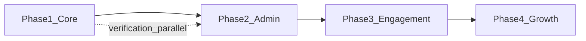

# Byte Forge MVP Master Roadmap and Requirements

Last updated: 2026-06-21 (four-phase execution strategy)

## Document Purpose

This document is the master product, architecture, UX, SEO, and execution roadmap for the initial production release of the Byte Forge agriculture marketplace ecosystem. It analyzes the current state of three applications as one product system:

- `byte-forge-auth` — NestJS API (auth, database, marketplace business logic). *Historically referenced as `byte-forge-backend` in older docs; use `byte-forge-auth` for all implementation paths.*
- `byte-forge-frontend-2` — buyer/seller marketplace frontend
- `byte-forge-admin` — admin operations panel

It should be treated as the working source of truth for MVP completion. It is intentionally direct about gaps and prioritization. **Execution order: §1.6 (summary) → §9 (full plan).**

---

# 1. Executive Summary

## 1.1 Product Vision

Byte Forge should not be a generic product listing site. The strongest version of the product is a knowledge-driven agriculture marketplace where buyers discover the right agricultural products through education, guidance, recommendations, and trust, while sellers grow through branded shops, educational content, product-linked campaigns, and marketplace analytics.

The most defensible MVP wedge is:

> Verified agricultural sellers + structured product knowledge + bilingual commerce + SEO-first discovery.

For launch, the implementation is currently strongest around plants and nursery marketplace flows. The broader agriculture categories (seeds, fertilizers, pots, equipment) should remain visible as future marketplace expansion but should not distract the MVP from finishing the plant/live-product commerce loop.

## 1.2 Business Goals

| Goal | Why It Matters | MVP Measurement |
|---|---|---|
| Acquire buyers through organic search | Paid acquisition will be expensive and weak without trust | Indexed landing/category/product pages, Search Console impressions, organic sessions |
| Convert education into purchases | Knowledge-driven commerce differentiates from Facebook pages/simple catalogs | Product page conversion, add-to-cart rate, guide-to-product click-through |
| Recruit and retain sellers | Supply quality is the marketplace bottleneck | Active verified shops, active products per shop, seller repeat activity |
| Build marketplace trust | Agriculture/live products require confidence in quality and delivery | Verified seller badge usage, review coverage, complaint rate, delivery confirmation rate |
| Complete COD order lifecycle | Payment gateway is deferred; COD must be operationally robust | Orders reaching `COMPLETED`, delivery confirmation rate, seller COD confirmation rate |

## 1.3 User Goals

### Buyers

- Find products that match their skill level, location, season, and environment.
- Understand how to care for products before and after buying.
- Trust that sellers are real and products are healthy.
- Track orders clearly, especially COD delivery and payment state.
- Receive recommendations that reduce decision fatigue.

### Sellers

- Build a trusted online shop presence.
- Create rich product listings with variants, care details, media, and inventory.
- Manage orders through a clear COD lifecycle.
- Promote products through campaigns and educational content.
- Understand performance and improve listings.

### Admins

- Operate marketplace quality, taxonomy, seller verification, payments catalog, content, SEO, campaigns, and trust workflows.
- Moderate sellers, products, reviews, reports, complaints, and educational content.
- Monitor marketplace health.

## 1.4 Marketplace Goals

- Move from listing inventory to guiding purchase decisions.
- Make every product page an educational page.
- Make every category page an SEO landing page.
- Make every seller shop a trust surface.
- Make admin operations capable of launching and safely scaling the marketplace.

## 1.5 Success Metrics

### North Star Metrics

- Monthly organic buyers visiting public plant/category/guide pages.
- Orders completed via COD lifecycle.
- Verified active seller shops with at least 10 active products.
- Product pages with complete care/SEO/review coverage.

### Supporting Metrics

| Area | Metrics |
|---|---|
| SEO | indexed URLs, impressions, organic CTR, top keyword rankings, Core Web Vitals |
| Buyer conversion | product page add-to-cart rate, checkout start rate, order completion rate |
| Seller growth | shops verified, active listings, seller order acceptance time, packed/shipped time |
| Trust | verified purchase review rate, cancellation rate, complaint rate, delivery confirmation rate |
| Content | guide views, guide-to-product clicks, seasonal campaign CTR |
| Admin operations | moderation backlog, verification SLA, unresolved reports, taxonomy completeness |

## 1.6 Execution Strategy (Primary Sequence)

Delivery order for the project. **Complete each phase before moving to the next**, except where noted as parallel work.

| Phase | Focus | Goal |
|---|---|---|
| **1** | Buyer & seller **core** | Launchable plant marketplace: COD commerce, trust, minimal discovery SEO, shop storefront Phase A |
| **2** | Admin **bare minimum** | Operate safely: verification, moderation, order visibility, shop suspend |
| **3** | **Engagement** & retention | Marketing/social notifications, follow, wishlist, shop campaigns/articles, seller analytics lite |
| **4** | **Growth** & platform | Knowledge hub, platform campaigns/coupons, programmatic SEO, payment gateway, full admin |

**Rules:**

1. **Define “core” narrowly in Phase 1** — not shop campaigns, articles, follow, wishlist, or seller analytics dashboards (those are Phase 3).
2. **Transactional notifications belong in Phase 1** — order placed, accepted/rejected, shipped, delivery confirm, verification status. Marketing and engagement emails are Phase 3.
3. **Thin admin in parallel** — seller verification queue may start at the **end of Phase 1** so verified shops can go live; full admin ops are Phase 2.
4. **Shop mock gating** — apply §2.7.5 before marketing `/shops`; Phase A de-mock is part of Phase 1.

Full task breakdown, exit criteria, and effort estimates: **§9**.

---

# 2. Current State Assessment

## 2.1 Evidence Base

This assessment is based on source inspection of the three apps and key files including:

- Backend root/module architecture: `byte-forge-auth/src/app.module.ts`, `src/api/user/user-api.module.ts`, `src/api/admin/admin-api.module.ts`
- Backend schema domains: `byte-forge-auth/src/_db/drizzle/schema/**`
- Frontend landing and commerce routes: `byte-forge-frontend-2/src/routes/(app)/index.tsx`, `/plants`, `/cart`, `/checkout`, `/shops`, `/shops/[slug]/**`, buyer/seller routes
- Frontend public shop module: `byte-forge-frontend-2/src/components/shops/public/**`, `src/lib/public-shops/public-shop.service.ts`, `src/lib/types/public/shops.types.ts`
- Frontend query/action/API/i18n architecture: `byte-forge-frontend-2/src/lib/api/**`, `src/i18n/**`
- Admin nav and route coverage: `byte-forge-admin/src/config/admin-nav.ts`, `src/routes/(protected)/**`
- Public backend shop API: `byte-forge-auth/src/api/public/shops/` (`GET /api/v1/shops/:slug` only)
- Project rules/docs recently created in each application for conventions and known architecture.
- Completed backend, frontend, admin, and market/SEO audit subagents run during this roadmap exercise.

## 2.2 Completion Estimates

These percentages are not code-volume estimates. They are weighted by MVP capability areas:

- Commerce workflow completeness
- Seller onboarding/listing/order management
- Buyer discovery/cart/checkout/order management
- Admin operational readiness
- SEO readiness
- Trust/moderation readiness
- Analytics/reporting readiness
- Production robustness

| Module | Completion | Rationale |
|---|---:|---|
| Frontend | 61% | Strong buyer/seller commerce UI, plant discovery, cart, checkout, buyer orders, seller shop/product/order flows. **Public shop discovery UI is largely built (mock-backed):** directory, nested shop detail routes, section nav, hero/trust surfaces. Major gaps: de-mock shop APIs, SEO metadata/sitemap/schema beyond shop detail basics, real content hub/blog, real recommendations/reviews in some areas, broken/missing routes such as favorites/settings and legacy register CTAs, broader category types, analytics, notifications, and test coverage. |
| Backend | 60% | Good foundation: auth, user/admin/public modules, shops, taxonomy, plants, cart/checkout/orders, COD lifecycle, media, shipping rates, reviews/payment schema. **Public shop backend is thin:** only `GET /api/v1/shops/:slug` (basic profile). Missing shop list, shop products public API (wired in frontend stub only), shop-level review aggregation, campaigns, articles, follow/wishlist, badges, analytics. Other gaps: plant update/publish/archive APIs, reviews API/moderation completion, admin orders, payment execution, content/blog/knowledge APIs, campaigns/offers, SEO management, notifications, reports/complaints, analytics, homepage CMS, and tests. |
| Admin | 35% | Core admin foundations exist: auth/session, shops, taxonomy/categories/tags, languages, payment methods, media, nav gating. Major operational sections are missing/disabled or mocked: dashboard metrics, shop detail tabs, users, product moderation, orders, transactions, content/blog, offers, complaints, SEO, homepage, campaigns, analytics, audit logs, monitoring. **No admin tools yet for seller campaigns, shop articles, or public storefront badge rules.** |
| **Public Shop Discovery & Storefront** | **32%** | **Buyer frontend ~78%** (mock facade + full route shell). **Seller frontend ~18%** (basic my-shop only; no story/mission/campaigns/articles editors). **Backend ~12%** (single public shop by slug). **Admin ~5%** (shop verification exists; no campaign/content/badge ops). See **§2.7** for per-capability tracker. *Tracked separately — not added into the Overall % formula below (would double-count Frontend/Backend work).*

### Overall Project Completion

**Overall project completion: 55%**

Calculation:

- Backend: 60% × 35% weight = 21.0
- Frontend: 61% × 40% weight = 24.4
- Admin: 35% × 25% weight = 8.75
- Total = 54.15%, rounded to **55%** (shop storefront UI progress offsets newly documented backend scope)

The **Public Shop Discovery & Storefront** row (32%) is a cross-cutting tracker for §2.7. Its buyer-FE progress is already reflected in the Frontend estimate; its backend gaps are reflected in the Backend estimate. Do not add 32% on top of the three-app total.

Frontend is weighted highest because buyer/seller UX, SEO surfaces, and conversion flows determine launch viability. Backend is close behind because workflows and schema determine reliability. Admin is smaller by code footprint but critical for production operations.

### MVP Completion

**MVP completion: 54%**

MVP-specific progress is measured against **§1.6 Phase 1 exit criteria** (buyer/seller core), not the full product vision. Many engagement and platform features are intentionally Phase 3–4.

**Public Shop Discovery & Storefront (tracked module): 32%** — Phase 1 should complete §2.7 Phase A only; Phase 3 completes campaigns/articles/follow. See §2.7 and §9.

### Production Readiness

**Production readiness: 36%**

Production launch target: **end of Phase 1** (buyer/seller core) with **Phase 2 started** (verification + moderation minimum). Full production readiness at scale requires Phase 2 complete.

The product has many implemented features, but production readiness is lower because launch requires:

- Phase 1 exit criteria (§9): COD loop, real reviews, transactional notifications, minimal SEO
- Phase 2 minimum: verification queue, product/review moderation, order visibility
- analytics and monitoring (Phase 3–4 for full dashboards)
- privacy/policy/help pages
- QA pass across buyer/seller flows (Phase 1); admin flows (Phase 2)
- seed/migration operational certainty
- **Shop storefront: no indexing of mock campaigns, articles, follower counts, or engagement metrics** (§2.7.5)
- **Homepage `FeaturedShops` must use real shops or be disabled before launch**

## 2.3 Frontend Current State

### Completed / Strong

- Public landing page with strong future ecosystem positioning: hero, trust, campaigns, featured plants, trending plants, featured shops, seasonal picks, seller CTA, newsletter.
- Public plant listing and plant detail routes.
- Plant detail has care content concepts, variants, gallery, related sections, review UI components.
- Buyer cart, checkout, confirmation, address management, profile, order list/detail.
- Seller shop setup, shop profile, verification, shipping rates, products/plants, inventory, seller orders, order detail, COD lifecycle UX.
- Shared order components: status badge, payment badge, shipment tracking, timelines.
- i18n foundation with `en.ts` and `bn.ts`.
- Shared API fetcher with locale, auth, CSRF behavior.
- **Public shop discovery (mock-backed):** `/shops` directory with search, category filter, sort, pagination; `/shops/{slug}` nested layout with Overview, Products, Reviews, Campaigns, Articles routes; `ShopHero`, `ShopDetailNav`, trust KPIs, reputation badges UI; `MetaProvider` + per-route SEO titles; `public-shop.service.ts` mock facade; homepage `FeaturedShops` wired to facade.

### Partially Completed

- Landing page campaign/recommendation/seasonal modules appear partly static and aspirational.
- **Shop discovery/detail is mock-backed** — `public-shop.service.ts` facade; not wired to `shops.api.ts` except future Phase 2 path documented in API file.
- Product recommendations and reviews appear partially mocked in public plant detail/seller product detail areas.
- **Shop-level reviews, campaigns, articles, analytics trends, similar shops, follow/share** are UI-only mocks on public shop pages.
- Non-plant product pages (pots/seeds/fertilizer) exist but are upcoming-feature pages.
- Seller dashboard is basic compared with required analytics/operational value.
- SEO metadata and structured data are not visibly mature.
- Some route guideline docs describe shop-id URL structures that do not fully match current single-shop seller protected implementation.

### Missing

- Blog/knowledge hub routes.
- Category landing pages built for SEO.
- Programmatic SEO pages.
- Sitemap/robots/canonical/hreflang strategy implementation.
- Route cleanup for broken or missing navigation such as `/auth/register`, `/app/favorites`, and `/app/settings`.
- Real homepage CMS/campaign data.
- Real newsletter capture workflow.
- Notifications inbox/prefs.
- Buyer recommendations engine beyond simple UI concepts.
- Reviews end-to-end UX tied to verified orders.
- Offers/campaign/coupon UX.
- **De-mock public shop discovery** (wire directory + detail sections to real APIs).
- **Seller extended storefront profile** (tagline, seller story, brand mission, why choose us, values, categories served).
- **Seller campaign CMS** and **seller shop articles CMS**.
- **Shop follow**, **wishlist**, campaign/article likes & bookmarks.
- **Shop reputation badge engine** and **storefront analytics** (buyer + seller dashboards).

## 2.4 Backend Current State

### Completed / Strong

- NestJS modular architecture.
- User/admin/public API modules.
- Auth/session/password reset foundation.
- Buyer modules: cart, checkout, orders, addresses.
- Seller modules: shop, products/plants, inventory, shipping rates, orders.
- Admin modules: auth/session/admin, shops, taxonomy, languages, payment methods, media.
- Public modules: plants, shops, categories, tags, location, payment methods.
- **Public shop by slug only** (`GET /api/v1/shops/:slug`) — basic name, description, logo, banner, address; no list, metrics, or section endpoints.
- Drizzle schema covers users, shops, products, taxonomy, cart, orders, shipping, inventory, reviews, media, payments/payment methods, locations.
- COD order lifecycle recently implemented with `COMPLETED`, delivery confirmation, shipping method, status transitions.
- Product SEO schema exists (`product-seo.schema.ts`), but full SEO system is not complete.

### Partially Completed

- Review schema exists, but full buyer review workflow/admin moderation/public integration appears incomplete.
- Payment methods are catalog-managed, but real gateway integration deferred.
- Payment schema exists, but COD is current MVP priority.
- Product model supports multiple product types, but implementation depth appears strongest for plants.
- Admin taxonomy exists, but content SEO taxonomy landing system is missing.

### Missing

- Blog/content/knowledge hub schema and APIs.
- Seller article/product-linked content APIs.
- Seller plant update/publish/archive/delete APIs.
- Offers, coupons, campaigns, featured listing APIs.
- Homepage CMS/config APIs.
- SEO metadata management beyond product SEO schema.
- Sitemap generation APIs/jobs.
- Notifications system (email/SMS/in-app event workflows).
- Reports/complaints/disputes workflow.
- Analytics/reporting event model.
- Audit logs/admin action logs.
- Moderation queues for products/reviews/content.
- **Public shops list** with search/filter/sort/pagination and computed trust metrics.
- **Public shop products** endpoint with search/filter/sort (frontend stub exists).
- **Shop-level review aggregation** across shop products.
- **Shop follow**, **wishlist**, **shop badges**, **engagement/analytics events**.
- **Seller campaigns** and **seller shop articles** schema + APIs.

## 2.5 Admin Current State

### Completed / Strong

- SolidStart admin app with protected layout and session checks.
- Admin navigation config with enabled/disabled rollout flags.
- Implemented enabled areas include shops, tag library, categories, languages, payment methods.
- Shop detail includes many tab-like routes for profile/contact/address/products/orders/owner/financials/history/verification/delivery/actions.
- Media/payment method management exists.
- Taxonomy management has categories/tags/tag groups.

### Partially Completed

- Many shop detail tabs exist, but some likely depend on partial/mocked data or limited APIs.
- Dashboard exists but likely not a complete marketplace command center.
- Nav contains disabled planned modules: vendors, products, orders, transactions, customers, approvals, reports.

### Missing

- User/customer management.
- Product moderation and catalog operations.
- Order operations dashboard.
- Blog/knowledge/content moderation.
- Offer/campaign management.
- Reports/complaints/disputes.
- SEO management.
- Homepage management.
- Analytics dashboards and export reports.
- Audit logs/system monitoring/settings.

## 2.6 Technical Debt and Risks

| Risk | Impact | Recommendation |
|---|---|---|
| Landing page contains static aspirational modules | Users see features not backed by data; SEO may index stale content | Replace with API-driven or clearly curated launch content |
| Broken frontend navigation links | Seller registration CTAs and protected account links can 404 or dead-end | Fix or remove `/auth/register`, `/app/favorites`, `/app/settings`, and placeholder footer/legal routes before launch |
| Mock reviews/recommendations | Trust risk and SEO quality risk | Wire real verified purchase reviews before indexing PDP review sections |
| Admin missing moderation and operational queues | Production marketplace cannot be safely operated | Build minimum admin operations before launch |
| Admin mock tabs and dashboards look real | Operators may mistake static shop/order/financial/activity data for production data | Replace with API-backed data or label/remove until implemented |
| SEO not first-class yet | Organic acquisition weak after launch | Implement metadata/sitemap/schema/category pages as P0 |
| Broad product vision vs plant-heavy implementation | Scope creep | Launch plants as focused MVP; position other categories as upcoming |
| Payment gateway deferred | Fine for MVP, but COD lifecycle must be robust | Prioritize COD completion, notifications, and dispute handling |
| Docs/route guidelines may diverge from implementation | Confusing future decisions | Update route docs after final seller route model is decided |
| **Public shop UI ahead of backend** | Buyers see campaigns/articles/followers that are not real | De-mock in phases (§2.7, §9); do not index mock engagement metrics as factual |
| **Shop detail mock data on production** | Trust and SEO risk if launched without API wire-up | Phase A de-mock (list + products + profile) before marketing shop discovery |

## 2.7 Public Shop Discovery & Storefront — Completion Tracker

This section tracks the **buyer-facing shop directory and shop detail storefront** implemented in `byte-forge-frontend-2` (routes under `/shops`, components in `src/components/shops/public/`, mock facade `src/lib/public-shops/public-shop.service.ts`). Percentages are **capability-weighted**, not lines of code.

### 2.7.1 Route & URL Model (implemented)

| URL | Route file | Status |
|---|---|---|
| `/shops` | `(app)/shops/(shops).tsx` | UI complete (mock data) |
| `/shops/{slug}` | `(app)/shops/[slug]/index.tsx` | Overview UI complete (mock) |
| `/shops/{slug}/products` | `(app)/shops/[slug]/products.tsx` | UI complete (mock) |
| `/shops/{slug}/reviews` | `(app)/shops/[slug]/reviews.tsx` | UI complete (mock) |
| `/shops/{slug}/campaigns` | `(app)/shops/[slug]/campaigns.tsx` | UI complete (mock) |
| `/shops/{slug}/articles` | `(app)/shops/[slug]/articles.tsx` | UI complete (mock) |
| Layout shell | `(app)/shops/[slug].tsx` | Complete — hero, nav, SEO, legacy `?tab=` redirect |

### 2.7.2 Per-Capability Completion

**Weighting formula:** `Module % = Σ (Weight × min(FE, Seller, BE, Admin layer applicable))`. Layer scores are 0–100% complete for that capability. The module total (**32%**) is the weighted average across all rows below.

| # | Capability | Buyer FE | Seller FE | Backend | Admin | Weight | Phase |
|---:|---|---:|---:|---:|---:|---:|---|
| 1 | Shop directory (list, search, filter, sort, pagination) | 92% | — | 5% | — | 14% | A |
| 2 | Shop detail shell (layout, hero, section nav, base SEO) | 95% | — | 15% | — | 10% | A |
| 3 | Overview tab (about, story, mission, reputation, stats, community, similar) | 90% | 20% | 8% | 5% | 12% | A–B |
| 4 | Products tab (featured, catalog, filter/sort → PDP links) | 88% | 30% | 25% | — | 11% | A |
| 5 | Reviews tab (shop-aggregated distribution + list) | 85% | 35% | 20% | 15% | 9% | A |
| 6 | Campaigns tab (history, highlights, engagement metrics) | 90% | 0% | 0% | 0% | 7% | C |
| 7 | Articles tab (educational content, editor's picks) | 90% | 0% | 0% | 0% | 7% | C |
| 8 | Follow shop + follower KPI | 10% | — | 0% | — | 4% | C |
| 9 | Share shop (Web Share / copy link) | 15% | — | — | — | 2% | B |
| 10 | Wishlist + wishlist-add metrics | 5% | — | 0% | — | 3% | C |
| 11 | Trust badges (TOP_SELLER, HIGHLY_RATED, etc.) | 85% | — | 0% | 10% | 5% | B |
| 12 | Storefront analytics & trend charts | 80% | 5% | 0% | 0% | 5% | B–D |
| 13 | Featured products curation (seller pins; products exist) | 70% | 0% | 15% | — | 4% | B |
| 14 | Wire mock facade → `shops.api.ts` / backend | 0% | — | 5% | — | 7% | A |

**Module weighted completion: 32%** (buyer FE ~78%, seller FE ~18%, backend ~12%, admin ~5%).

### 2.7.3 De-Mock Phases (execution order)

| Phase | Goal | Deliverables | Unlocks |
|---|---|---|---|
| **A — Core storefront** | Replace mocks for discovery + catalog | See **A1–A3** below | Directory + overview core + products + reviews on real data |
| **B — Trust layer** | Credible metrics without full CMS | Computed trust KPIs from orders/reviews; badge rules; similar shops; share handler; profile view events; `LocalBusiness` JSON-LD | Overview reputation trustworthy for SEO |
| **C — Engagement** | Retention + social proof | Shop follow API; wishlist; campaign/article public read + detail routes; likes/bookmarks; seller campaign + article CRUD (minimal) | Campaigns + articles tabs; follow button |
| **D — Growth** | Seller growth tools | Full campaign engine + checkout/coupon hooks; seller analytics dashboard; trend rollups; admin campaign/content moderation | Charts, campaign participation, seller storefront ROI |

#### Phase A sub-phases

| Sub-phase | Backend / schema | Frontend | Notes |
|---|---|---|---|
| **A1** | `GET /shops` (verified + ACTIVE only, search/filter/sort/page); extend `GET /shops/:slug` | Wire directory + layout hero from API | List must match mock rule: `isVerified && status === ACTIVE` |
| **A2** | `GET /shops/:slug/products` (pagination, filter, sort, featured flags); extended profile via **shop translations** (EN/BN): tagline, about, story, mission, values, whyChooseUs, categoriesServed | Wire products tab; seller storefront profile editor | Schema changes require user-owned migrations (`db:generate` / `db:migrate`) |
| **A3** | `GET /shops/:slug/reviews` — **aggregate approved product reviews** where `product.shopId` matches; distribution computed in query or materialized nightly view | Wire reviews tab; switch `public-shop.service.ts` from mock to API for A1–A3 | Reuse existing review tables; no duplicate shop-review entity required for MVP |

#### Phase A partial-mock UX (until Phase B)

While overview statistics, community metrics, similar shops, and badges remain mock or empty:

- **Option 1 (recommended for production):** Hide sections until API returns data.
- **Option 2 (dev/staging only):** Show mock with a visible “Preview data” banner.
- **Never** ship mock follower/campaign/savings counts as factual on production or in JSON-LD.

### 2.7.5 Production gating (shop storefront)

Before marketing `/shops` or indexing shop URLs in production:

| Surface | Gate |
|---|---|
| `/shops` directory | Real `GET /shops` or `noindex` + disable nav links |
| Overview: about, products, reviews | Real APIs (Phase A) or hide sections |
| Overview: statistics, community, similar, badges | Phase B or **hide** |
| `/shops/{slug}/campaigns` | Phase C or **hide nav link + `noindex`** |
| `/shops/{slug}/articles` | Phase C or **hide nav link + `noindex`** |
| Follow button | Disabled until Phase C (current `followSoon` tooltip) |
| Follower / engagement KPIs in hero | Hide or show only computed real metrics |
| Homepage `FeaturedShops` | Real shops from API or admin curation — not mock facade |
| Campaign/article likes & bookmarks | Phase C — do not show interactive UI until APIs exist |

### 2.7.4 Implementation Checklist (shop module)

#### Buyer frontend (`byte-forge-frontend-2`)

- [x] Shop directory page with toolbar (search, category, sort, pagination)
- [x] Nested shop detail layout (`[slug].tsx`) with `RouteSectionProps`
- [x] Section navigation via `<A>` links (not query tabs)
- [x] Overview / Products / Reviews / Campaigns / Articles child routes
- [x] `ShopHero`, `ShopDetailNav`, trust snapshot, about, reputation, statistics, community, similar shops components
- [x] `MetaProvider` + layout/section `<Title>` / OG meta
- [x] `FeaturedShops` on homepage via mock facade
- [x] `PublicShop*` types + mock data (10 verified shops)
- [x] Section nav `noScroll` on `<A>` links (preserve scroll between sections)
- [ ] Wire `public-shop.service.ts` to real `shops.api.ts` endpoints (A1–A3)
- [ ] Hide or gate mock-only sections per §2.7.5 before production
- [ ] Follow shop (authenticated)
- [ ] Share shop handler (Web Share API + copy fallback)
- [ ] Article detail routes: `/shops/{slug}/articles/{articleSlug}`
- [ ] Campaign detail routes: `/shops/{slug}/campaigns/{campaignSlug}`
- [ ] Campaign participation / apply-at-checkout UX (Phase D)
- [ ] Campaign/article like & bookmark interactions (Phase C)
- [ ] Products tab server-side pagination (beyond mock `limit: 50`)
- [ ] Shop `LocalBusiness` / `AggregateRating` JSON-LD (when data real)
- [ ] Loading/error/empty states per section on API failures
- [ ] Display `businessHours` and shipping context on shop overview (optional Phase A+)
- [ ] Contact seller / report shop entry points (link to complaints flow)
- [ ] Shop route/component tests

#### Seller frontend

- [x] Basic my-shop (branding, contact, address, verification)
- [ ] Extended storefront profile editor (tagline, story, mission, why choose us, values, categories) — **EN/BN via shop translations**
- [ ] Featured product pinning on storefront
- [ ] Campaign management UI
- [ ] Shop articles / educational content CMS UI
- [ ] Storefront analytics dashboard (mirror public KPIs)

#### Backend (`byte-forge-auth`)

- [x] `GET /api/v1/shops/:slug` (basic public shop)
- [ ] `GET /api/v1/shops` — **verified + ACTIVE only**; search, filter, sort, pagination
- [ ] `GET /api/v1/shops/:slug/products` — pagination, filter, sort, featured flags
- [ ] `GET /api/v1/shops/:slug/reviews` — aggregate approved reviews by `shopId` (query or materialized view)
- [ ] Extended shop profile fields + **shop translation rows** (EN/BN) + seller PATCH
- [ ] Trust metrics computation (orders, rating, delivery success, response rate*, cancellation)
- [ ] Shop badges assignment/computation (*response rate requires messaging SLA system — defer or proxy from order accept time)
- [ ] Engagement score formula documented and computed from events
- [ ] `shop_follows`, wishlist tables + APIs
- [ ] Shop-scoped campaigns schema + seller CRUD + public list/detail
- [ ] Shop articles schema + seller CRUD + public list/detail
- [ ] Campaign/article likes & bookmarks APIs
- [ ] Analytics events + daily rollups for storefront charts
- [ ] Similar shops recommendation endpoint
- [ ] Homepage featured shops curation endpoint or ranking job
- [ ] Public 404 for non-ACTIVE / unverified shops (list + detail consistent)
- [ ] Shop storefront API tests

*User-owned migration workflow: schema changes only in `src/_db/drizzle/schema/**`; user runs `db:generate` and `db:migrate`.*

#### Admin

- [ ] Campaign manager (approve, schedule, feature) — **shop-scoped** (see §4.16 vs §4.9)
- [ ] Shop article moderation — **seller-owned content** (distinct from platform §4.8 guides)
- [ ] Badge override / reputation rules config
- [ ] Storefront metrics in shop detail (real data, not mock tabs)
- [ ] Feature shops on homepage / directory
- [ ] Editor's pick for shop articles (platform curation flag)
- [ ] Verification status → public `isVerified` on list API
- [ ] Suspend shop → remove from public list and return 404 on storefront

---

# 3. Marketplace Expansion Strategy

## 3.1 Core Strategic Shift

Current implementation proves a marketplace spine. The product must now add a knowledge and trust spine.

The platform should evolve from:

> Browse product → add to cart → checkout

To:

> Learn what fits my crop/home/season/location → trust seller → buy product → receive care guidance → review/return → repeat.

## 3.2 Buyer Engagement Features

### Must Have for MVP

- Product care summaries on product cards and product detail pages.
- Category/product landing pages with educational intro copy.
- Verified seller badges on product/shop surfaces.
- Real reviews from verified purchases.
- Post-purchase care instructions linked from order detail and email.
- Seasonal homepage modules curated for launch.

### Should Have

- Crop/plant guides by category.
- Beginner-friendly product discovery quiz.
- Seasonal recommendations (monsoon, summer, winter).
- Disease/problem FAQ pages (static, expert-reviewed).
- Smart recommendations based on category, care difficulty, shop, price, and inventory.

### Nice to Have

- Community Q&A.
- AI/image disease diagnosis.
- Personalized garden/crop tracker.
- Expert consultation marketplace.

## 3.3 Seller Growth Features

### Must Have for MVP

- Verified shop profile with logo, banner, story, contact, policies.
- Product completeness scoring (media, variants, care, SEO fields).
- Simple seller order lifecycle dashboard.
- Seller shipping rates and shop status visibility.

### Should Have

- Seller-authored shop story/articles with admin moderation.
- Product-linked educational notes.
- Promotions/coupons/free-shipping thresholds.
- Featured listings and featured shop campaigns.
- Seller analytics: views, add-to-cart, orders, revenue, top products.

### Nice to Have

- Full seller blog CMS.
- Automated campaign builder.
- Advanced inventory forecasting.
- Seller SEO assistant.

## 3.4 Marketplace Growth Features

### Must Have for MVP

- Knowledge-lite: 10-20 launch guides/articles authored by the platform.
- Category landing pages for SEO and education.
- Trust policies: delivery, live product care, returns/disputes policy even if returns are deferred operationally.
- Admin-curated homepage campaigns.

### Should Have

- Expert content with author bios.
- Location-based recommendations.
- Agricultural trend pages.
- Product comparison modules.
- Related category/product internal linking.

### Nice to Have

- User-generated guides.
- Community groups.
- Professional agronomist service marketplace.
- B2B bulk ordering and procurement.

---

# 4. Complete Module Breakdown

## 4.1 Authentication and Session

### Purpose
Enable secure buyer, seller, and admin access.

### Features
- User signup/login/logout.
- Email verification.
- Password reset.
- Admin auth/session.
- Role-aware route guards.

### User Stories
- As a buyer, I can register and manage my account.
- As a seller, I can access seller workspace after shop setup.
- As an admin, I can securely manage platform operations.

### APIs Required
- User auth/login/register/logout/session.
- Email verification and password reset.
- Admin auth/session/logout/refresh.

### Database Requirements
- Users, local auth, sessions, admin users/sessions.

### Admin Requirements
- View users/admins, deactivate/suspend accounts, audit sessions.

### SEO Considerations
- Auth routes should be noindex.

## 4.2 Seller Management

### Purpose
Onboard, verify, and manage sellers/shops.

### Features
- Shop setup and profile.
- Verification document workflow.
- Shop branding (logo/banner/story).
- Shipping rates.
- Seller status management.

### User Stories
- As a seller, I can create and brand my shop.
- As a seller, I can submit verification documents.
- As an admin, I can approve/reject/suspend shops.

### APIs Required
- Shop CRUD/profile updates.
- Verification submit/status/history.
- Shipping rates CRUD.
- Admin shop moderation endpoints.

### Database Requirements
- Shop, translations, address, contact, business, verification, verification history, shipping rates.

### Admin Requirements
- Verification queue, shop profile viewer, status actions, document review, audit history.

### SEO Considerations
- Public shop pages need canonical slug URLs, title/meta, LocalBusiness schema where appropriate.
- Extended storefront profile fields (§4.16) via shop translations (EN/BN).

## 4.3 Buyer Management

### Purpose
Support buyer profile, addresses, orders, reviews, and trust flows.

### Features
- Profile.
- Addresses.
- Order history/detail.
- Delivery confirmation.
- Reviews.
- Favorites/wishlist (recommended MVP+).

### APIs Required
- Address CRUD.
- Buyer orders and order group detail.
- Confirm delivery.
- Review create/list/update/delete.

### Database Requirements
- User, addresses, order groups/orders, reviews, favorites/wishlist.

### Admin Requirements
- Buyer account view, order history, complaint/review moderation.

### SEO Considerations
- Buyer account pages noindex.

## 4.4 Product Management

### Purpose
Allow sellers to create and manage sellable inventory with educational metadata.

### Features
- Product list/detail.
- Plant creation wizard.
- Variants/media/inventory.
- Care instructions.
- Product SEO metadata.
- Future product types: pots, seeds, fertilizers, equipment.

### APIs Required
- Seller product CRUD.
- Plant-specific create/update.
- Variant inventory updates.
- Public product listing/detail.

### Database Requirements
- Products, product translations, product variants, variant translations, product media, product SEO, product tags, type-specific detail/variant attribute tables.

### Admin Requirements
- Product moderation queue, status actions, category/tag assignment review, quality/completeness checks.

### SEO Considerations
- Product pages require SSR metadata, Product schema, Offer schema, canonical slug, image alt, breadcrumbs.

## 4.5 Category and Taxonomy Management

### Purpose
Power discovery, filtering, content organization, and SEO landing pages.

### Features
- Categories with hierarchy and translations.
- Tags and tag groups.
- Category landing pages.
- Attribute-based filters.

### APIs Required
- Public category/tree APIs.
- Admin category CRUD/hierarchy.
- Admin tags/tag groups CRUD.

### Database Requirements
- Category, category translations, hierarchy, tags, tag translations, tag groups.

### Admin Requirements
- Category tree manager, tag library, translations, merge/deprecate tools.

### SEO Considerations
- Category pages are high-priority organic pages; require unique intros, FAQs, internal links, sitemap inclusion.

## 4.6 Cart and Checkout

### Purpose
Support buyer purchase intent and COD order creation.

### Features
- Guest/user cart.
- Address selection.
- Payment method selection (COD MVP).
- Review order by shop.
- Place order.

### APIs Required
- Cart CRUD.
- Checkout place order.
- Payment method read APIs.

### Database Requirements
- Cart, cart items, orders, order groups, order items, order address, payment method references.

### Admin Requirements
- Checkout/order failure monitoring.

### SEO Considerations
- Cart/checkout noindex.

## 4.7 Order Lifecycle

### Purpose
Track COD order from placement to completion.

### Features
- Seller accept/reject.
- Seller pack/ship.
- Buyer delivery confirmation.
- Seller COD payment confirmation.
- Shipment tracking details.
- Status timeline.

### APIs Required
- Seller order list/detail/status/ship/cancel.
- Buyer order list/group/detail/cancel/confirm-delivery.
- Shipment update hooks later.

### Database Requirements
- Orders, order groups/items/address, shipments, order status history, shipment history.

### Admin Requirements
- Order operations dashboard, forced status correction (restricted), dispute view, export.

### SEO Considerations
- Order pages noindex.

## 4.8 Blog / Knowledge Hub

*Platform-owned editorial content. For **seller-owned** articles on shop storefronts, see **§4.16**.*

### Purpose
Turn the marketplace into an education-driven ecosystem.

### Features
- Crop/plant guides.
- Disease/problem articles.
- Seasonal care articles.
- Product-linked recommendations.
- Expert author profiles.

### APIs Required
- Admin content CRUD.
- Public content listing/detail.
- Content-product/category/tag relationships.
- Publish workflow.

### Database Requirements
- Articles, translations, authors, content categories, content tags, related products, SEO fields, publish/moderation status.

### Admin Requirements
- Content editor, moderation, schedule/publish, SEO preview, internal links.

### SEO Considerations
- Article schema, FAQ schema, breadcrumbs, canonical URLs, sitemap, internal links to products/categories.

## 4.9 Offers and Campaigns

*Platform and homepage campaigns, coupons, featured listings. For **seller-scoped shop campaigns** on `/shops/{slug}/campaigns`, see **§4.16**.*

### Purpose
Drive conversion and repeat purchasing.

### Features
- Shop offers/coupons.
- Platform campaigns.
- Featured listings.
- Seasonal campaigns.
- Free shipping thresholds.

### APIs Required
- Campaign CRUD.
- Offer/coupon validation.
- Homepage campaign feed.
- Seller campaign participation.

### Database Requirements
- Campaigns, offers, coupons, campaign products/categories/shops, redemptions.

### Admin Requirements
- Campaign manager, approvals, scheduling, metrics.

### SEO Considerations
- Campaign landing pages can rank seasonally; avoid expired thin pages by redirecting/archive strategy.

## 4.10 Search and Recommendations

### Purpose
Improve discovery and conversion.

### Features
- Product search.
- Category filters.
- Attribute filters.
- Related products.
- Beginner/seasonal/location recommendations.

### APIs Required
- Search endpoint.
- Recommendation endpoints.
- Trending/featured endpoints.

### Database Requirements
- Search-index-friendly fields, view/click/order events, feature flags.

### Admin Requirements
- Search synonym manager, featured ranking controls.

### SEO Considerations
- Search result pages generally noindex unless curated landing page with unique content.

## 4.11 SEO System

### Purpose
Make organic search a first-class acquisition channel.

### Features
- Metadata per product/category/shop/article.
- Dynamic sitemap.
- Robots rules.
- Schema markup.
- Canonical/hreflang.
- OpenGraph images.
- SEO audit dashboard.

### APIs Required
- SEO metadata management.
- Sitemap route/generator.
- Admin SEO CRUD.

### Database Requirements
- SEO metadata tables for products/categories/shops/content or polymorphic SEO entity table.

### Admin Requirements
- SEO editor, missing metadata report, noindex controls, sitemap health, broken links.

### SEO Considerations
- This module is the SEO system.

## 4.12 Notifications

### Purpose
Keep buyers/sellers informed and reduce operational confusion.

### Features
- Order placed.
- Seller accepted/rejected.
- Packed/ready.
- Shipped.
- Delivery confirmation request.
- COD payment confirmation.
- Verification updates.

### APIs Required
- Notification preferences.
- In-app notification list.
- Email/SMS trigger services.

### Database Requirements
- Notifications, templates, preferences, delivery logs.

### Admin Requirements
- Template manager, delivery log, resend controls.

### SEO Considerations
- None, private noindex.

## 4.13 Reviews and Trust

### Purpose
Build buyer confidence and seller accountability.

### Features
- Verified purchase reviews.
- Rating aggregates.
- Review images.
- Moderation status.
- Seller response later.
- **Shop-level review aggregation** for `/shops/{slug}/reviews` (§4.16) — roll up product reviews by `shopId`.

### APIs Required
- Buyer review CRUD.
- Public reviews list.
- Admin moderation.

### Database Requirements
- Reviews, review images, moderation fields, order item linkage.

### Admin Requirements
- Review moderation queue, abuse report handling.

### SEO Considerations
- Product AggregateRating schema only after real reviews exist.

## 4.14 Analytics and Reporting

### Purpose
Measure product, seller, buyer, SEO, and operational health.

### Features
- Marketplace dashboard.
- Seller analytics.
- Product analytics.
- SEO analytics.
- Order funnel.

### APIs Required
- Event ingestion.
- Aggregation endpoints.
- Admin/seller dashboards.

### Database Requirements
- Events table or analytics pipeline, materialized aggregates.

### Admin Requirements
- Charts, date filters, exports, scheduled reports.

### SEO Considerations
- Search Console integration later.

## 4.15 Admin Operations

### Purpose
Operate the marketplace safely.

### Features
- User/seller/product/order moderation.
- Content moderation.
- Complaints/reports.
- Audit logs.
- System monitoring.
- Settings.

### APIs Required
- Admin CRUD/action endpoints for each domain.
- Audit log endpoints.
- Reports/complaints workflows.

### Database Requirements
- Audit logs, reports, complaints, moderation queues, settings.

### SEO Considerations
- Admin pages noindex.

## 4.16 Public Shop Discovery & Storefront

### Relationship to §4.8 and §4.9

| Concern | §4.8 Blog / Knowledge Hub | §4.9 Offers and Campaigns | §4.16 Shop Storefront |
|---|---|---|---|
| **Owner** | Byte Forge platform (editorial) | Platform + seller promotions | Seller-branded public presence |
| **Content** | Crop guides, disease FAQs, seasonal platform articles | Homepage campaigns, coupons, featured listings | Seller story, shop products, shop reviews, **seller articles**, **seller campaigns** |
| **URLs** | `/learn/{slug}` | `/campaigns/{slug}` (platform) | `/shops/{slug}`, `/shops/{slug}/articles/{slug}`, etc. |
| **Admin** | Platform content editor | Campaign manager, coupon approval | Moderate seller articles/campaigns; feature shops |
| **MVP** | Phase 2 knowledge hub | Phase 2 offers | Phase A de-mock core; Phase C engagement tabs |

Shop articles are **seller-owned, moderated** content on the shop storefront — not duplicates of platform knowledge hub articles. Shop campaigns are **seller-scoped promotions** surfaced on `/shops/{slug}/campaigns` — distinct from homepage seasonal campaigns in §4.9.

### Purpose
Enable buyers to discover verified sellers, evaluate trust, browse shop catalogs, and engage with seller campaigns and educational content — turning each shop into a branded trust surface and SEO landing entity.

### Features

#### Buyer-facing (public)
- Shop directory: search, category filter, sort (popular, rating, products, followers, engagement, newest), pagination.
- Shop detail nested routes: Overview, Products, Reviews, Campaigns, Articles.
- Shop hero: logo, banner, verification badge, location, member since, trust KPI snapshot.
- Overview: about, seller story, brand mission, categories served, why choose us, values, reputation, performance trends, community metrics, similar shops.
- Products: featured carousel, searchable/filterable catalog linking to product PDPs.
- Reviews: rating distribution, verified purchase reviews aggregated at shop level.
- Campaigns: active/upcoming/completed campaigns with savings/participant metrics.
- Articles: seller educational content with views/likes and editor's picks.
- Follow shop, share shop (planned).
- Section-level SEO metadata.

#### Seller-facing
- Extended storefront profile beyond basic my-shop (tagline, story, mission, values, why choose us).
- Featured product curation for storefront.
- Campaign creation and performance tracking.
- Shop articles / educational content publishing.
- Storefront analytics dashboard (views, engagement, repeat buyers, trends).

#### Platform
- Trust badge engine (TOP_SELLER, HIGHLY_RATED, FAST_RESPONDER, etc.).
- Engagement event tracking (profile views, product views, wishlist adds).
- Similar shops recommendations.

### User Stories
- As a buyer, I can browse verified shops and open a shop's product catalog without leaving the marketplace trust context.
- As a buyer, I can read shop reviews and educational content before purchasing from that seller.
- As a buyer, I can follow a shop to return later (post-MVP).
- As a seller, I can present my brand story and mission on my public shop page.
- As a seller, I can run campaigns and publish care/education articles linked to my shop.
- As an admin, I can moderate shop campaigns and articles and configure trust badges.

### APIs Required

| Endpoint | Priority | Status |
|---|---|---|
| `GET /api/v1/shops` (list, search, filter, sort, page) | Must (Phase A) | Not implemented |
| `GET /api/v1/shops/:slug` (extended profile + metrics) | Must (Phase A) | Partial (basic fields only) |
| `GET /api/v1/shops/:slug/products` | Must (Phase A) | Frontend stub only |
| `GET /api/v1/shops/:slug/reviews` | Must (Phase A) | Not implemented |
| `GET /api/v1/shops/:slug/statistics` | Should (Phase B) | Not implemented |
| `GET /api/v1/shops/:slug/community` | Should (Phase B) | Not implemented |
| `GET /api/v1/shops/:slug/similar` | Should (Phase B) | Not implemented |
| `POST/DELETE /api/v1/user/buyer/shops/:slug/follow` | Should (Phase C) | Not implemented |
| `GET/POST /api/v1/user/buyer/wishlist` | Should (Phase C) | Not implemented |
| Seller `PATCH` extended storefront profile | Must (Phase A) | Not implemented |
| Seller campaigns CRUD | Should (Phase C) | Not implemented |
| `GET /api/v1/shops/:slug/campaigns` | Should (Phase C) | Not implemented |
| Seller articles CRUD | Should (Phase C) | Not implemented |
| `GET /api/v1/shops/:slug/articles` | Should (Phase C) | Not implemented |
| `GET /api/v1/shops/:slug/articles/:articleSlug` | Should (Phase C) | Not implemented |
| `GET /api/v1/shops/:slug/campaigns/:campaignSlug` | Should (Phase C) | Not implemented |
| `POST/DELETE .../campaigns/:id/like`, `.../bookmark` | Could (Phase C) | Not implemented |
| `POST/DELETE .../articles/:id/like` | Could (Phase C) | Not implemented |
| `POST /api/v1/checkout/apply-campaign` or coupon hook | Should (Phase D) | Not implemented |
| Analytics event ingestion | Should (Phase B–D) | Not implemented |
| `GET /api/v1/homepage/featured-shops` or ranking | Should (Phase A/B) | Not implemented |

### Database Requirements
- Extended shop profile fields via **existing shop translation pattern** (EN/BN): tagline, sellerStory, brandMission, categoriesServed, whyChooseUs, values.
- `shop_follows` (buyer ↔ shop).
- `wishlists` / wishlist items (product-level, roll up to shop metrics).
- `shop_badges` or computed badge eligibility cache.
- `shop_articles`, article translations, article-product links, `isEditorsPick` (admin-set).
- `shop_scoped_campaigns` (or `campaigns.shop_id`) — separate from platform homepage campaigns in §4.9.
- `analytics_events` + daily rollups for storefront charts.
- Featured product flags on products or `shop_featured_products` join table.

### Admin Requirements
- Moderate seller campaigns and shop articles.
- Configure or override reputation badges.
- View real storefront metrics on shop detail (replace mock admin tabs where applicable).
- Feature shops on homepage / directory.

### SEO Considerations
- Index: `/shops`, `/shops/{slug}`, `/shops/{slug}/products`, `/shops/{slug}/reviews` (when real data).
- Section-specific titles (implemented in frontend via `@solidjs/meta`).
- `LocalBusiness` / `Organization` schema on shop overview when address public.
- `AggregateRating` on shop only after real aggregated reviews exist.
- Campaign/article detail pages need canonical URLs before indexing (Phase C).
- Do not index mock engagement metrics.

### Current Implementation Reference
- Frontend mock facade: `byte-forge-frontend-2/src/lib/public-shops/public-shop.service.ts`
- Types: `byte-forge-frontend-2/src/lib/types/public/shops.types.ts`
- API client (Phase 2 wire-up): `byte-forge-frontend-2/src/lib/api/endpoints/public/shops.api.ts`
- Backend: `byte-forge-auth/src/api/public/shops/`

---

# 5. SEO Strategy

## 5.1 SEO-Critical MVP Features

| Priority | Feature | Why |
|---|---|---|
| P0 | Product metadata and canonical URLs | Product pages must rank and share cleanly |
| P0 | Category landing pages | Highest scalable organic surface |
| P0 | Dynamic sitemap + robots | Enables crawl discovery/control |
| P0 | Product schema + breadcrumbs | Rich results and crawl understanding |
| P0 | Hreflang/canonical for EN/BN | Prevents duplicate language confusion |
| P0 | Performance optimization | Core Web Vitals directly affect SEO/conversion |
| P1 | Blog/knowledge hub | Long-tail traffic and trust |
| P1 | FAQ schema | Captures educational queries |
| P1 | Internal linking engine | Moves authority between guides/categories/products |

## 5.2 Current SEO Blockers

- No clear implemented sitemap/robots strategy found.
- No mature metadata system visible across public routes.
- Product SEO schema exists in backend but full frontend/admin usage is incomplete.
- Landing page includes static campaign/seasonal ideas but not an SEO-managed CMS feed.
- No public blog/knowledge routes.
- No public category landing pages.
- Some review/recommendation content appears mocked; should not be indexed as real.
- **Public shop campaigns, articles, follower counts, and engagement charts are mock-backed** — apply §2.7.5 gating before indexing `/shops` URLs.

## 5.3 Technical SEO Requirements

### URL Strategy

| Page Type | Recommended URL |
|---|---|
| Homepage | `/` |
| Plant listing | `/plants` |
| Plant detail | `/plants/{slug}` |
| Shop listing | `/shops` |
| Shop overview | `/shops/{shopSlug}` |
| Shop products | `/shops/{shopSlug}/products` |
| Shop reviews | `/shops/{shopSlug}/reviews` |
| Shop campaigns | `/shops/{shopSlug}/campaigns` |
| Shop articles | `/shops/{shopSlug}/articles` |
| Shop article detail | `/shops/{shopSlug}/articles/{articleSlug}` |
| Shop campaign detail | `/shops/{shopSlug}/campaigns/{campaignSlug}` |
| Category landing | `/categories/{categorySlug}` |
| Knowledge hub | `/learn` |
| Guide | `/learn/{guideSlug}` |
| Platform campaign | `/campaigns/{campaignSlug}` |

### Metadata Strategy

Each public indexable route needs:

- Title
- Meta description
- Canonical URL
- OpenGraph title/description/image
- Twitter card metadata
- Optional noindex flag
- Hreflang alternates for EN/BN

### Structured Data

| Schema | Where |
|---|---|
| `Product` | Product detail pages |
| `Offer` | Product variant price/availability |
| `BreadcrumbList` | Product, category, shop, guide pages |
| `Organization` | Homepage |
| `LocalBusiness` | Shop pages if address public |
| `AggregateRating` | Product/shop after real reviews exist |
| `FAQPage` | Category and guide pages |
| `Article` | Knowledge hub content (§4.8) and shop articles (§4.16) when published |
| `ItemList` | Category/listing pages |

### Sitemap Strategy

Create dynamic sitemap including:

- Homepage
- Plant listing
- Active product slugs
- Active shop slugs (`/shops/{slug}` overview only until section APIs real)
- Shop product/review section URLs when backed by real data (§2.7.5)
- Published shop article/campaign detail URLs (Phase C+)
- Category landing pages
- Published platform knowledge articles (§4.8)
- Active platform campaign pages (§4.9)

Exclude:

- Auth
- Cart
- Checkout
- Buyer/seller dashboards
- Admin
- Filter/search pages without unique content

### Programmatic SEO Strategy

Start only after metadata and category page quality is stable.

Priority templates:

1. Category pages: `Indoor Plants`, `Fruit Plants`, `Medicinal Plants`
2. Category × difficulty: `Beginner Indoor Plants`
3. Attribute pages: `Low Light Plants`, `Pet Safe Plants`
4. Seasonal pages: `Monsoon Plant Care`, `Summer Plants Bangladesh`
5. Problem pages: `Why Are Plant Leaves Turning Yellow?`
6. Shop category pages: `ShopName Indoor Plants`

Quality guardrail:

- Do not index pages with thin copy, duplicate metadata, or low product count.

## 5.4 On-Page SEO Requirements

### Product Page

- H1: product common/local name.
- Care summary above the fold.
- Variant price/availability visible.
- Seller trust badge.
- Reviews if real.
- FAQ section.
- Related products.
- Internal links to category/shop/guide.

### Category Page

- H1 category name.
- 150-300 word educational intro.
- Product grid.
- Top care advice.
- FAQ block.
- Related categories/tags.

### Blog/Guide Page

- Expert-reviewed content.
- Clear author/date.
- Related products and categories.
- FAQ and how-to blocks where useful.
- CTA into filtered products.

## 5.5 Performance SEO

- Optimize hero and product images via responsive Cloudinary sizes.
- Lazy-load non-critical image grids.
- Avoid indexing pages that require client-only data to render meaningful content.
- Verify SSR output for product/category/shop pages.
- Keep JS payload low on public SEO routes.

## 5.6 SEO Roadmap

### SEO Phase 1 - Launch Blockers

- Metadata helper/component system.
- Product/category/shop metadata integration.
- Sitemap and robots.
- Product JSON-LD and breadcrumbs.
- Canonical/hreflang.

### SEO Phase 2 - Content Expansion

- Category landing pages.
- Knowledge hub MVP.
- Seasonal guides.
- FAQ schema.

### SEO Phase 3 - Programmatic Growth

- Attribute landing pages.
- Location pages.
- Shop × category pages.
- Search Console-based optimization.

---

# 6. Admin Panel Master Plan

## 6.1 Dashboard

### Features
- Revenue/order metrics.
- Buyer/seller counts.
- Product counts and approval state.
- Content counts.
- Verification queue count.
- Complaint/report count.
- SEO issue count.

### Charts
- Orders over time.
- GMV/COD completed value.
- Active sellers/products.
- Traffic/conversion funnel.
- Top categories.

### Exports
- CSV export for orders, sellers, products, payouts later.

## 6.2 User Management

### Features
- Search/filter users.
- View profile, orders, reviews, complaints.
- Suspend/reactivate user.
- Reset verification manually if needed.

### Permissions
- Support admin: view + limited actions.
- Super admin: suspend/delete/export.

## 6.3 Seller Management

### Features
- Seller/shop verification queue.
- Shop profile review.
- Document review.
- Status actions: approve, reject, suspend, reactivate.
- Seller performance metrics.

### Required Statistics
- Pending verifications.
- Active/suspended shops.
- Products per shop.
- Orders per shop.
- Cancellation/complaint rate.

## 6.4 Product Moderation

### Features
- Product approval queue.
- Image review.
- SEO completeness check.
- Category/tag correctness.
- Care-guide completeness.
- Archive/remove product.

### Reports
- Low-quality listing report.
- Missing media/care/SEO fields.
- Out-of-stock active listings.

## 6.5 Blog/Knowledge Moderation

### Features
- Article editor.
- Publish workflow.
- SEO preview.
- Product/category linking.
- Author management.
- Draft/scheduled/published/archive statuses.

## 6.6 Offer/Campaign Management

### Features
- Campaign CRUD.
- Featured shops/products.
- Seasonal campaigns.
- Coupon/offer approval.
- Scheduling.

### Charts
- Campaign impressions/clicks/orders.
- Campaign conversion rate.
- Revenue attributed.

## 6.7 Reports and Complaints

### Features
- Buyer report queue.
- Product/shop/review complaint handling.
- Assign owner/status.
- Internal notes.
- Resolution actions.

## 6.8 SEO Management

### Features
- SEO metadata editor.
- Missing metadata report.
- Sitemap controls.
- Noindex controls.
- OpenGraph preview.
- Broken links report.

## 6.9 Homepage Management

### Features
- Hero banner control.
- Featured categories/plants/shops.
- Campaign modules.
- Seasonal picks.
- Testimonials.
- Newsletter copy.

## 6.10 Analytics

### Features
- Marketplace funnel.
- Seller analytics.
- Product/category analytics.
- Search analytics.
- SEO analytics.

## 6.11 Audit Logs

### Features
- Admin action history.
- Before/after changes.
- Actor/time/resource.
- Export/filter.

## 6.12 System Monitoring and Settings

### Features
- API health.
- Email/SMS delivery status.
- Upload/media errors.
- Feature flags.
- Platform settings.

---

# 7. Database and API Gap Analysis

## 7.1 Existing Schema Strengths

Existing schema appears to cover:

- Users/auth/sessions.
- Shops and shop verification.
- Products and product type detail tables.
- Product variants/media/SEO/tags.
- Taxonomy categories/tags/tag groups.
- Cart/checkout/orders/order history.
- Shipments.
- Inventory.
- Reviews and review images.
- Payment methods/payments.
- Media.
- Location divisions/districts.

## 7.2 Missing Entities

| Entity | Required For | Priority |
|---|---|---|
| Articles/Guides | Knowledge hub, SEO | Must |
| Article translations | EN/BN content | Must |
| Article-product/category relations | Commerce-linked education | Must |
| Authors/experts | Trust content | Should |
| Platform campaigns (`homepage_campaigns` or equivalent) | Homepage + seasonal growth (§4.9) | Must/Should |
| Shop-scoped campaigns (`shop_id` on campaigns) | Seller storefront tab (§4.16) | Should (Phase C) |
| Offers/coupons | Conversion | Should |
| Notifications | Operational lifecycle | Must |
| Notification templates/logs | Email/SMS/in-app | Should |
| Reports/complaints | Trust/safety | Must |
| Moderation queues | Admin operations | Must |
| Audit logs | Admin accountability | Should |
| Analytics events | Reporting/growth | Should |
| Homepage modules | CMS control | Should |
| SEO metadata by entity | Search growth | Must |
| Sitemap records/jobs | SEO automation | Should |
| `shop_follows` | Shop follower KPI, directory sort | Should (Phase C) |
| `wishlists` | Buyer saves, shop engagement metrics | Should (Phase C) |
| `shop_badges` / badge rules | Reputation section | Should (Phase B) |
| `shop_articles` + translations | Shop articles tab, seller CMS (§4.16) | Should (Phase C) |
| Extended shop profile + translation fields | Overview tab content (§4.16) | Must (Phase A) |
| `analytics_events` + rollups | Trends, community metrics | Should (Phase B) |
| `shop_featured_products` or product flags | Featured carousel | Should (Phase B) |
| Campaign/article likes & bookmarks | Engagement on storefront | Could (Phase C) |

## 7.3 Missing APIs

- Blog/knowledge public/admin APIs.
- Category landing page content APIs.
- Homepage module APIs.
- Campaign/offer/coupon APIs.
- Notification APIs and triggers.
- Review CRUD/moderation APIs if not completed.
- Reports/complaints APIs.
- Admin product moderation APIs.
- Admin user/customer management APIs.
- Analytics aggregation APIs.
- SEO metadata APIs.
- Sitemap/robots generation endpoints.
- **Public shops list + extended shop detail APIs.**
- **Public shop products, reviews, statistics, community, similar shops APIs.**
- **Shop follow and wishlist APIs.**
- **Seller extended storefront profile update API.**
- **Seller shop campaigns and shop articles CRUD + public read APIs.**

## 7.4 Missing Validation/Workflow

- Product publish readiness validation (media, price, inventory, care, SEO).
- Content publish validation.
- Campaign scheduling validation.
- Review eligibility validation tied to delivered/completed orders.
- Complaint state machine.
- Admin action audit logging.
- **Shop list filter: only verified + ACTIVE shops on public `GET /shops`.**
- **Shop review aggregation eligibility** (approved reviews only, tied to shop's products).
- **Engagement score formula** and badge threshold rules documented.
- **Production gating checklist** (§2.7.5) before `/shops` SEO indexing.
- **Analytics consent** for profile-view tracking (if required by policy).

---

# 8. UX and Conversion Optimization Review

## 8.1 Buyer Journey Gaps

| Stage | Current | Gap | Recommendation |
|---|---|---|---|
| Landing | Strong static concept modules | Static/future ideas not fully backed | Make modules API-driven or curated launch content |
| Discovery | Plant list/filter | Missing category SEO landings and guide-led discovery | Add category/guide pathways |
| Shop discovery | `/shops` UI complete (mock) | Backend thin; mock engagement risky if indexed | Phase A de-mock + §2.7.5 gating |
| PDP | Rich plant concept | Mock reviews/recommendations risk | Wire real reviews/recommendations |
| Cart | Implemented | Trust/policy clarity can improve | Add delivery/live plant guarantee messaging |
| Checkout | COD flow | Notifications and reassurance missing | Add order summary, expected timeline, COD reminders |
| Post-purchase | Orders exist | Care continuity missing | Link order items to care guide and send reminders |

## 8.2 Seller Journey Gaps

| Stage | Current | Gap | Recommendation |
|---|---|---|---|
| Onboarding | Shop setup/verification | Need clearer checklist | Add seller launch checklist |
| Product creation | Strong plant wizard | Other product types deferred | Keep upcoming UX; focus plant quality |
| Order management | COD lifecycle implemented | Notifications/analytics missing | Add seller alerts and order SLA indicators |
| Growth | Shop page exists | **Public storefront UI built (mock); no promotions/content/analytics backend** | Phase A–D de-mock per §2.7; add seller campaign/article tools in Phase C |

## 8.3 Trust Signals Missing

- Verified seller badge consistently across PDP, shop, cart, checkout.
- Verified purchase review indicator.
- Live product delivery/care policy.
- Seller response time/order acceptance reliability.
- **Shop storefront trust metrics must be computed, not mocked, before public launch.**
- Admin moderation badges for quality products.

## 8.4 Conversion Improvements

### Must

- Real reviews.
- Clear COD explanation.
- Delivery timeline/status clarity.
- Care difficulty and environment match above the fold.
- Stock/variant clarity.

### Should

- Beginner-friendly filters.
- “Best for balcony/indoor/low light” curated collections.
- Similar products from same category/shop.
- Abandoned cart/checkout reminders later.

---

# 9. Development Roadmap

This section follows the **four-phase execution strategy** in §1.6. Older roadmap labels (e.g. “MVP Phase 1”, “Marketplace Expansion”) are mapped below for traceability.

### Legacy phase mapping

| §1.6 phase | Former §9 labels | Shop module (§2.7) |
|---|---|---|
| Phase 1 — Core | MVP Completion, Phase 1b de-mock | Phase A (+ gating); Phase B KPIs optional |
| Phase 2 — Admin | Part of old MVP Phase 1 (admin rows) | — |
| Phase 3 — Engagement | Marketplace Expansion (engagement rows) | Phase C–D |
| Phase 4 — Growth | Growth Features + Scale | Platform §4.8 / §4.9 |

---

## Phase 1 — Buyer & Seller Core

### Goal
Ship a **credible, launchable** plant-focused marketplace: buyers can discover plants, order with COD, and track delivery; sellers can onboard, list, and fulfill orders. Public shop discovery works on **real data** for directory, overview, products, and reviews (not mock campaigns/followers).

### In scope (core)

**Buyer**

- Auth, profile, addresses
- Plant listing and PDP (real data)
- Cart, checkout (COD), order list/detail, delivery confirmation
- Verified purchase reviews (read on PDP; write after eligible orders)
- Public shop directory + detail **Phase A** (§2.7.3 A1–A3) with §2.7.5 gating on mock sections

**Seller**

- Shop setup, branding, contact, address, verification **submit**
- Products/plants create, inventory, shipping rates
- Seller order lifecycle (accept, pack, ship, COD complete)
- Extended storefront profile fields (EN/BN) — tagline, story, mission, values (Phase A2)

**Platform / cross-cutting**

- **Transactional** notifications and emails (order + verification events)
- **Minimal SEO**: PDP metadata, sitemap/robots, canonical/hreflang on key public routes
- Category landing pages (or curated plant discovery equivalent)
- Trust/policy/help pages
- Replace or gate homepage modules that imply unbuilt features
- End-to-end QA on buyer/seller commerce flows

### Out of scope (defer to later phases)

- Shop campaigns tab, articles tab, follow shop, wishlist
- Seller analytics dashboards, trend charts, engagement score
- Platform knowledge hub (§4.8), platform homepage campaigns (§4.9)
- Full admin panel, review moderation UI (Phase 2 — except verification queue may start in parallel)
- Marketing notifications, newsletter, abandoned cart
- Payment gateway

### Phase 1 task table

| Task | Priority | Complexity | Business Impact | Dependencies |
|---|---|---|---|---|
| Harden COD order lifecycle + QA | Must | M | Very High | — |
| Verified reviews E2E (buyer write, public read, PDP) | Must | M | High | Review APIs |
| Transactional notifications (order + verification) | Must | M/L | High | Email/in-app templates |
| SEO metadata + sitemap/robots + canonical/hreflang | Must | M | Very High | Public routes |
| Category landing pages (or launch-equivalent discovery) | Must | M | Very High | Category API/content |
| Trust policy/help pages | Must | S | High | Content |
| Fix broken nav (`/auth/register`, favorites, settings) | Must | S | Medium | — |
| Homepage modules: real data or remove mock claims | Must | M | High | CMS or curated API |
| **Shop Phase A1–A3** de-mock + §2.7.5 gating | Should | M | High | Public shops APIs |
| Seller plant update/publish/archive APIs | Should | M | High | Backend gaps |
| **Seller verification queue (admin)** — *parallel, end of Phase 1* | Should | M | High | Admin + backend |

Estimated effort: **8–12 weeks** (team-dependent).

### Phase 1 — Shop storefront de-mock (§2.7.3)

Runs as part of Phase 1 when `/shops` is in launch scope.

| Task | Priority | Complexity | Business Impact | Dependencies |
|---|---|---|---|---|
| **A1** `GET /api/v1/shops` (verified+ACTIVE) + wire directory | Should | M | High | Metrics aggregation |
| **A2** Extend slug + products API + EN/BN profile editor | Should | M | High | Schema migration (user-owned) |
| **A3** Shop-aggregated reviews + wire reviews tab | Should | M | High | Review tables |
| Replace `public-shop.service.ts` with API client | Should | S | High | A1–A3 |
| Apply §2.7.5 production gating (hide mock sections) | Must | S | High | Before `/shops` launch |
| Trust KPI computation (orders, rating, delivery) | Could | M | Medium | Order/review data |
| Homepage `FeaturedShops` real data | Should | S | Medium | A1 or admin curation |

Estimated effort: **3–5 weeks** (can overlap Phase 1 main work).

### Phase 1 exit criteria

- [ ] Buyer can complete COD order from plant PDP through delivery confirmation
- [ ] Seller can fulfill order through COD complete
- [ ] Reviews on PDP are real (verified purchase)
- [ ] Transactional emails/notifications fire for order and verification events
- [ ] Public plant (and shop, if launched) pages have metadata and sitemap coverage
- [ ] Mock shop sections (campaigns, articles, followers) gated per §2.7.5
- [ ] At least one verified shop can be approved via admin and appear on public surfaces

---

## Phase 2 — Admin Bare Minimum

### Goal
Operate the marketplace **safely at small scale** without building the full admin vision (§6). Enough control to verify sellers, moderate catalog/trust content, and support orders.

### In scope

- Shop **verification queue** (approve / reject / request changes) — complete if started in Phase 1
- **Product moderation** (approve, flag, archive low-quality listings)
- **Review moderation** (approve, remove, abuse reports)
- **Order operations** (list, detail, read-only support view; restricted status correction if needed)
- **Shop suspend / deactivate** → public storefront 404 and removal from directory
- **User/customer lookup** (basic search, view profile and order history)
- Replace or hide **mock admin shop tabs** with API-backed data or explicit “not available”
- Admin auth/session hardening and QA

### Out of scope (Phase 4)

- Full analytics dashboards and exports
- Homepage CMS, platform campaign manager
- SEO management console, audit logs, system monitoring
- Blog/knowledge hub editor (platform content)
- Complaints/disputes full workflow (basic report queue acceptable if minimal)

### Phase 2 task table

| Task | Priority | Complexity | Business Impact | Dependencies |
|---|---|---|---|---|
| Verification queue UI + actions | Must | M | Very High | Existing shop APIs |
| Product moderation queue | Must | L | Very High | Admin product APIs |
| Review moderation queue | Must | M | High | Review admin APIs |
| Order operations dashboard (read-focused) | Must | M | High | Admin order APIs |
| Shop suspend → public list/detail off | Must | S | High | Public shop APIs |
| Basic user/customer search and view | Should | M | Medium | Admin user APIs |
| Wire or hide mock shop detail admin tabs | Should | M | Medium | — |

Estimated effort: **4–8 weeks**.

### Phase 2 exit criteria

- [ ] New seller can be verified and appear publicly without manual DB edits
- [ ] Bad product/review can be removed before buyers see it
- [ ] Support can find an order and seller by admin UI
- [ ] Suspended shop no longer appears on `/shops`

---

## Phase 3 — Engagement & Retention

### Goal
Grow repeat usage and seller success: social features, seller content/campaigns, richer notifications, and lightweight analytics — **after** core commerce and admin ops are stable.

### In scope

**Notifications (engagement)**

- In-app notification inbox and preferences
- Marketing-style triggers: campaign alerts, shop updates (where applicable)
- Newsletter capture workflow (if retained on landing)
- Abandoned cart / checkout reminders (optional)

**Buyer engagement**

- Follow shop + follower counts (real)
- Wishlist / favorites
- Shop **campaigns** tab de-mock + campaign detail routes + seller campaign CMS
- Shop **articles** tab de-mock + article detail routes + seller article CMS
- Campaign/article likes and bookmarks
- Share shop handler

**Seller growth**

- Storefront analytics lite (views, orders, top products — mirror public KPIs where useful)
- Featured product pinning on storefront
- Reputation badges engine (§2.7 Phase B)
- Similar shops, community metrics, trend charts (§2.7 Phase B–D)

**Admin (engagement ops)**

- Moderate seller campaigns and shop articles
- Feature shops on homepage / directory; editor’s pick for articles
- Badge override / reputation rules (basic)

### Phase 3 task table

| Task | Priority | Complexity | Business Impact |
|---|---|---|---|
| Shop follow + wishlist APIs and UI | Should | M | Medium |
| Seller campaign CRUD + public campaigns tab | Should | L | High |
| Seller article CRUD + public articles tab | Should | L | High |
| Campaign/article detail pages + likes/bookmarks | Could | M | Medium |
| Seller analytics lite dashboard | Should | M | High |
| In-app notifications + prefs | Should | M | High |
| Reputation badges + trust KPI charts | Should | M | High |
| Admin campaign/article moderation | Should | M | High |
| Homepage CMS / featured modules (real curation) | Should | M | High |

Estimated effort: **8–14 weeks**.

### Phase 3 exit criteria

- [ ] Buyer can follow a shop and see real follower count
- [ ] Seller can publish a campaign and article visible on storefront
- [ ] No mock data on campaigns/articles/followers tabs
- [ ] Seller sees basic performance metrics in dashboard

---

## Phase 4 — Growth & Platform

### Goal
Scale acquisition, content-led differentiation, monetization, and full operational maturity.

### In scope

- **Platform knowledge hub** (§4.8): `/learn`, editorial CMS, expert authors
- **Platform offers/campaigns** (§4.9): coupons, checkout integration, seasonal homepage campaigns
- Programmatic SEO, recommendation engine, review images/Q&A
- Payment gateway integration
- Advanced analytics pipeline, admin audit logs, monitoring, settings
- Full admin dashboards (§6): analytics exports, complaints/disputes, SEO console
- Non-plant product types (seeds, fertilizer, pots) — full workflows when plant MVP proves retention
- Nice-to-have: AI diagnosis, B2B bulk, regional personalization, community knowledge

### Phase 4 task table

| Task | Priority | Complexity | Business Impact |
|---|---|---|---|
| Knowledge hub CMS + public routes | Should | L | Very High |
| Platform campaigns + coupon checkout hooks | Should | L | High |
| Programmatic SEO pages | Should | L | Very High |
| Recommendation engine | Should | L | High |
| Payment gateway | Future | L | High |
| Admin audit logs + monitoring + full analytics | Should | L | High |
| Advanced campaigns and attribution | Nice | L | High |
| Expand product categories beyond plants | Nice | XL | Medium |

Estimated effort: **ongoing 3–6+ months**.

---

## Phase summary diagram

| Phase | Primary apps | Completion focus |
|---|---|---|
| 1 | `byte-forge-frontend-2`, `byte-forge-auth` | Buyer/seller commerce + transactional comms + minimal SEO |
| 2 | `byte-forge-admin`, `byte-forge-auth` | Verification, moderation, orders |
| 3 | All three | Follow, campaigns, articles, analytics lite |
| 4 | All three | Platform content, payments, scale |

---

# 10. Final Completion Checklist

Items are tagged by execution phase (§1.6): **P1** = Phase 1 core, **P2** = admin minimum, **P3** = engagement, **P4** = growth. Untagged items span multiple phases or are ongoing.

## Frontend

- [ ] Metadata system for public pages.
- [x] Shop detail section-level `<Title>` / OG meta (layout + child routes).
- [ ] Product detail JSON-LD.
- [ ] Breadcrumb schema.
- [ ] Category landing pages.
- [ ] Knowledge hub routes.
- [ ] Real homepage campaign/featured data.
- [ ] Real reviews UI replacing mocks.
- [ ] Real recommendations replacing mocks.
- [ ] Newsletter submission integration.
- [ ] Trust/policy pages.
- [ ] Buyer favorites/wishlist if MVP scope includes it.
- [ ] Fix broken `/auth/register` marketing CTAs to use the real registration route.
- [ ] Implement or remove `/app/favorites` and `/app/settings` links.
- [ ] Replace default SolidJS 404 with branded marketplace 404.
- [x] Public shop directory page (mock-backed).
- [x] Public shop detail nested routes (overview, products, reviews, campaigns, articles).
- [x] Shop detail layout with hero + link-based section nav (`noScroll` on section links).
- [ ] Wire public shop pages to real API data (de-mock A1–A3 in `public-shop.service.ts`).
- [ ] Apply §2.7.5 gating — hide/noindex mock campaigns, articles, engagement before launch.
- [ ] Wire public shop products tab to real `GET /shops/:slug/products` with pagination.
- [ ] Follow shop UX (authenticated).
- [ ] Share shop handler (Web Share + copy link).
- [ ] Shop article detail routes (`/shops/{slug}/articles/{articleSlug}`).
- [ ] Shop campaign detail routes (`/shops/{slug}/campaigns/{campaignSlug}`).
- [ ] Campaign/article like & bookmark UI (Phase C).
- [ ] Shop `LocalBusiness` / `AggregateRating` JSON-LD when data is real.
- [ ] Seller extended storefront profile editor (EN/BN translations: story, mission, values, tagline).
- [ ] Seller campaign management UI.
- [ ] Seller shop articles CMS UI.
- [ ] Seller storefront analytics (mirror public KPIs).
- [ ] Seller product completeness indicators.
- [ ] Notification UI/inbox or at least email-trigger UX.
- [ ] Responsive QA for all public/buyer/seller flows.

## Backend

- [ ] Blog/knowledge schema and APIs.
- [ ] Campaign/offer/coupon schema and APIs.
- [ ] **Public shops list API — verified + ACTIVE only (`GET /api/v1/shops`).**
- [ ] **Extended public shop profile + trust metrics on `GET /api/v1/shops/:slug` (EN/BN).**
- [ ] **Public shop products API with pagination, filter, sort.**
- [ ] **Shop-aggregated reviews API (approved product reviews by shopId).**
- [ ] **Seller extended storefront profile PATCH.**
- [ ] **Shop follow API.**
- [ ] **Wishlist API.**
- [ ] **Shop campaigns schema + seller CRUD + public list.**
- [ ] **Shop articles schema + seller CRUD + public list/detail.**
- [ ] **Campaign/article likes & bookmarks APIs.**
- [ ] **Homepage featured shops API or curation.**
- [ ] **Checkout campaign/coupon apply hook (Phase D).**
- [ ] **Storefront analytics events + rollups.**
- [ ] **Shop badge computation / assignment.**
- [ ] Notification schema/service/templates.
- [ ] Review CRUD and moderation completion.
- [ ] Seller plant update/publish/archive/delete endpoints.
- [ ] Admin order operations endpoints.
- [ ] Order status email/SMS/in-app notification triggers.
- [ ] Unpaid order expiry job if `EXPIRED` remains a supported status.
- [ ] Payment record creation/status sync for COD and future prepaid methods.
- [ ] Reports/complaints schema and APIs.
- [ ] Admin product moderation endpoints.
- [ ] Admin user/customer endpoints.
- [ ] Homepage CMS/config APIs.
- [ ] SEO metadata APIs.
- [ ] Sitemap/robots generation.
- [ ] Analytics events/aggregates.
- [ ] Audit logs.
- [ ] Test coverage for order lifecycle, checkout, seller verification, reviews.
- [ ] **Shop storefront public API tests.**
- [ ] Cleanup duplicate/unwired admin shop API modules.

## Admin

- [ ] Real dashboard metrics.
- [ ] User management.
- [ ] Seller management enhancements.
- [ ] Product moderation.
- [ ] Order operations.
- [ ] Replace mock shop profile/contact/address/products/orders/financials/history tabs with API-backed data or hide them.
- [ ] Wire shop suspend/deactivate/reactivate actions where backend APIs already exist.
- [ ] Review moderation.
- [ ] Blog/content management.
- [ ] Offer/campaign management.
- [ ] **Shop campaign moderation.**
- [ ] **Shop article / educational content moderation.**
- [ ] **Reputation badge configuration.**
- [ ] **Feature shops on homepage / directory.**
- [ ] **Editor's pick flag for shop articles.**
- [ ] **Verification → public `isVerified` on list API.**
- [ ] **Suspended shop removed from public storefront.**
- [ ] SEO management.
- [ ] Homepage management.
- [ ] Complaints/reports.
- [ ] Analytics exports.
- [ ] Audit logs.
- [ ] System monitoring/settings.

## Database

- [ ] Content/articles tables.
- [ ] Campaign/offers/coupons tables.
- [ ] Notification tables.
- [ ] Reports/complaints tables.
- [ ] Audit logs.
- [ ] Analytics events/rollups.
- [ ] Homepage modules.
- [ ] SEO metadata expansion.
- [ ] Sitemap/indexing support.
- [ ] **Extended shop profile columns.**
- [ ] **shop_follows table.**
- [ ] **wishlists table.**
- [ ] **shop_badges or badge eligibility cache.**
- [ ] **shop_articles + translations.**
- [ ] **shop-scoped campaigns tables.**
- [ ] **shop_featured_products or product featured flags.**
- [ ] **Campaign/article likes & bookmarks tables.**

## APIs

- [ ] Public category landing endpoint.
- [ ] Public guide/article endpoints.
- [ ] Public reviews endpoints.
- [ ] Recommendation endpoints.
- [ ] Homepage content endpoints.
- [ ] Admin moderation APIs.
- [ ] Seller analytics APIs.
- [ ] Notification APIs.
- [ ] Campaign APIs.
- [ ] **Public shops list + extended detail endpoints.**
- [ ] **Public shop products/reviews/statistics/community/similar endpoints.**
- [ ] **Shop follow + wishlist endpoints.**
- [ ] **Seller storefront profile + campaigns + articles endpoints.**
- [ ] **Campaign/article detail public endpoints.**

## SEO

- [ ] Robots.txt.
- [ ] Dynamic sitemap.xml.
- [ ] Canonical tags.
- [ ] Hreflang EN/BN.
- [ ] Metadata for public routes.
- [ ] **Shop overview/products/reviews metadata (partial — section titles done).**
- [ ] **Shop JSON-LD (`LocalBusiness`, `AggregateRating` when real).**
- [ ] **Sitemap: shop section URLs only when §2.7.5 gating satisfied.**
- [ ] OpenGraph/Twitter metadata.
- [ ] Product schema.
- [ ] Breadcrumb schema.
- [ ] FAQ schema.
- [ ] Category content.
- [ ] Internal linking rules.
- [ ] Search Console setup.
- [ ] Performance/CWV audit.

## Infrastructure

- [ ] Production env validation.
- [ ] Error monitoring.
- [ ] Log aggregation.
- [ ] Database backup plan.
- [ ] Media/CDN settings.
- [ ] Deployment checklist.
- [ ] Rate limiting/security review.

## Analytics

- [ ] Event taxonomy.
- [ ] Conversion funnel tracking.
- [ ] Seller metrics.
- [ ] SEO metrics.
- [ ] Campaign attribution.
- [ ] Admin reporting dashboards.

## Content

- [ ] 10-20 launch guides.
- [ ] Category intros.
- [ ] Homepage curated copy.
- [ ] Policy pages.
- [ ] Seller onboarding/help content.
- [ ] FAQ content.
- [ ] Bengali content parity for launch-critical pages.

## QA

- [ ] Buyer registration/login/logout.
- [ ] Seller shop setup/verification.
- [ ] Product creation/edit/inventory.
- [ ] Public product discovery.
- [ ] **Public shop directory and shop detail section navigation.**
- [ ] **§2.7.5 production gating verified before indexing `/shops`.**
- [ ] Cart/checkout/order creation.
- [ ] COD order lifecycle.
- [ ] Buyer delivery confirmation.
- [ ] Seller COD completion.
- [ ] Admin verification/moderation flows.
- [ ] Mobile responsive pass.
- [ ] Accessibility pass.
- [ ] SEO crawl simulation.

---

# Final Recommendation

The fastest credible path to MVP is not to expand every agricultural category immediately. Launch around the strongest implemented vertical: plants and nursery commerce. Use care content, category SEO, seller verification, and COD lifecycle as the core trust/differentiation loop. Keep seeds, fertilizers, pots, and equipment visible as the expansion path, but avoid building their full workflows until the plant marketplace proves acquisition, conversion, and seller retention.

**Follow the four-phase execution order in §1.6 and §9:**

1. **Buyer & seller core** — commerce, transactional notifications, minimal SEO, shop Phase A de-mock with §2.7.5 gating.
2. **Admin bare minimum** — verification, moderation, orders (verification queue may start at end of Phase 1).
3. **Engagement** — follow, wishlist, shop campaigns/articles, seller analytics lite, marketing notifications.
4. **Growth** — platform knowledge hub, platform campaigns/coupons, programmatic SEO, payment gateway, full admin tooling.

Do not launch publicly until Phase 1 exit criteria are met and Phase 2 can handle the first wave of verified sellers. Shop campaigns, articles, and follower metrics must not be presented as real until Phase 3. Distinguish platform content (§4.8) and platform campaigns (§4.9) from seller storefront modules (§4.16).
