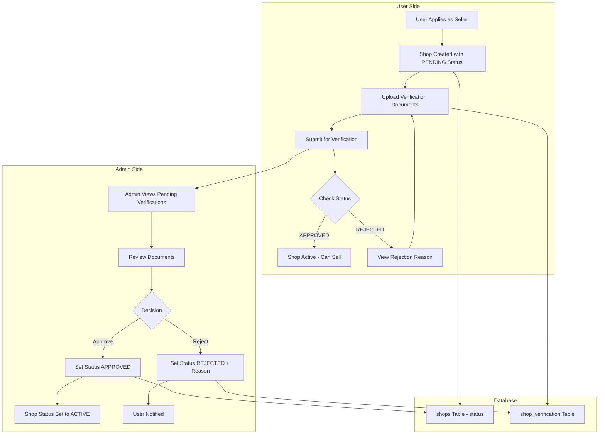

# Shop Verification Completion Plan

## Overview

This plan outlines the phased implementation of a complete shop verification system, allowing users to submit and manage verification documents while admins can review and approve/reject shop applications.

---

## Architecture



---

## Phase 1: Database Schema Update

### 1.1 Update Schema File

**File**: `src/_db/drizzle/schema/shop/shop.verification.schema.ts`

**Changes**:
- Add `rejectionReason` column (TEXT, nullable)
- Add `adminNotes` column (TEXT, nullable) - for internal admin use

```typescript
export const shopVerificationTable = pgTable('shop_verification', {
  // ... existing fields ...
  
  rejectionReason: text('rejection_reason'),
  adminNotes: text('admin_notes'),
});
```

### 1.2 Generate Migration

```bash
cd byte-forge-auth
pnpm db:generate
pnpm db:migrate:docker
```

### 1.3 Update TypeScript Types

Types will be auto-generated from the schema. Verify in:
- `TShopVerification` type includes new fields

---

## Phase 2: Backend - User Verification Endpoints

### 2.1 Create DTO

**File**: `src/api/user/seller/shop/dto/update-verification.dto.ts`

```typescript
import { createZodDto } from 'nestjs-zod';
import { z } from 'zod';

export const updateVerificationSchema = z.object({
  tradeLicenseNumber: z
    .string()
    .trim()
    .min(1, 'Trade license number is required')
    .optional(),
  tradeLicenseDocumentId: z
    .uuid({ message: 'Invalid UUID' })
    .optional(),
  tinNumber: z
    .string()
    .trim()
    .optional(),
  tinDocumentId: z
    .uuid({ message: 'Invalid UUID' })
    .optional(),
  utilityBillDocumentId: z
    .uuid({ message: 'Invalid UUID' })
    .optional(),
});

export class UpdateVerificationDto extends createZodDto(updateVerificationSchema) {}
```

### 2.2 Implement Endpoints

**File**: `src/api/user/seller/shop/shop.controller.ts`

**New Endpoints**:

```typescript
@Get('my-shop/verification')
async getMyVerification(@AuthenticUser() user: TAuthenticUser) {
  // Returns verification status and documents
}

@Patch('my-shop/verification')
async updateMyVerification(
  @Body() dto: UpdateVerificationDto,
  @AuthenticUser() user: TAuthenticUser,
) {
  // Updates verification documents
}
```

### 2.3 Service Methods

**File**: `src/api/user/seller/shop/shop.service.ts`

**New Methods**:
- `getVerificationStatus(userId: string)` - Returns verification record
- `updateVerificationDocuments(shopId: string, dto: UpdateVerificationDto)` - Updates documents

---

## Phase 3: Backend - Admin Verification Enhancement

### 3.1 Update DTO

**File**: `src/api/admin/admin-shop/dto/verify-shop.dto.ts`

```typescript
export const verifyShopSchema = z.object({
  status: z.enum([
    ShopVerificationStatusEnum.APPROVED,
    ShopVerificationStatusEnum.REJECTED,
  ]),
  reason: z.string().optional().refine(
    (val, ctx) => {
      const status = ctx.parent.status;
      if (status === ShopVerificationStatusEnum.REJECTED && !val) {
        return false;
      }
      return true;
    },
    { message: 'Rejection reason is required when rejecting a shop' }
  ),
});
```

### 3.2 Update Service

**File**: `src/api/admin/admin-shop/admin-shop.service.ts`

**Method**: `verifyShop()`

```typescript
async verifyShop(shopId: string, dto: VerifyShopDto) {
  return this.db.transaction(async (tx) => {
    const verifications = await this.shopVerificationRepository.update(
      {
        status: dto.status,
        verifiedAt: dto.status === 'APPROVED' ? new Date() : null,
        rejectionReason: dto.status === 'REJECTED' ? dto.reason : null,
      },
      { shopId },
      tx,
    );

    if (dto.status === ShopVerificationStatusEnum.APPROVED) {
      await this.shopRepository.update(
        shopId,
        { status: ShopStatusEnum.ACTIVE },
        tx,
      );
    }

    return verification;
  });
}
```

---

## Phase 4: Frontend - Verification UI Components

### 4.1 Verification Status Card

**File**: `src/components/seller/VerificationStatusCard.tsx`

**Purpose**: Display current verification status with color-coded badges

**Status Display**:
- 🟡 PENDING - "Under Review"
- 🔵 REVIEWING - "Admin Reviewing"
- 🟢 APPROVED - "Verified"
- 🔴 REJECTED - "Rejected" (show reason)

### 4.2 Document Uploader

**File**: `src/components/seller/VerificationDocumentUploader.tsx`

**Purpose**: Upload and manage verification documents

**Fields**:
- Trade License Number + Document Upload
- TIN Number + Document Upload
- Utility Bill Document Upload

### 4.3 Verification Management Page

**File**: `src/routes/(protected)/app/seller/setup-shop/verification.tsx`

**Layout**:
```
┌─────────────────────────────────────┐
│  Verification Status Card           │
│  [Status Badge] [Last Updated]      │
├─────────────────────────────────────┤
│  If REJECTED: Show Reason Box       │
├─────────────────────────────────────┤
│  Document Upload Form               │
│  - Trade License                    │
│  - TIN Number                       │
│  - Utility Bill                     │
├─────────────────────────────────────┤
│  [Save Changes] [Submit for Review] │
└─────────────────────────────────────┘
```

---

## Phase 5: Testing & Polish

### 5.1 Backend Testing

**Test Cases**:
1. User can submit verification documents
2. User can update documents before approval
3. Admin can approve shop → Shop status becomes ACTIVE
4. Admin can reject shop → Reason is saved
5. Rejected user can resubmit documents
6. 404 if user has no shop
7. 403 if user tries to update another user's shop

### 5.2 Frontend Testing

**Test Cases**:
1. Status card shows correct status
2. Rejection reason is visible to user
3. Document upload works with validation
4. Form validation prevents empty submissions
5. Success/error notifications work

### 5.3 Edge Cases

- User deletes shop while verification pending
- Admin verifies already active shop
- User submits empty documents
- Multiple rapid submissions

---

## API Summary

### User Endpoints

| Method | Endpoint | Auth | Purpose |
|--------|----------|------|---------|
| GET | `/user/seller/shops/my-shop/verification` | ✅ | Get verification status |
| PATCH | `/user/seller/shops/my-shop/verification` | ✅ | Update documents |

### Admin Endpoints

| Method | Endpoint | Auth | Purpose |
|--------|----------|------|---------|
| GET | `/admin/shops/pending-verifications` | ✅ | List pending |
| POST | `/admin/shops/:id/verify` | ✅ | Approve/Reject |

---

## Database Schema Changes

### shop_verification Table

| Column | Type | Nullable | Default | Description |
|--------|------|----------|---------|-------------|
| `rejectionReason` | TEXT | ✅ | NULL | Reason shown to user |
| `adminNotes` | TEXT | ✅ | NULL | Internal admin notes |

---

## Success Criteria

- [ ] Users can submit verification documents
- [ ] Users can view their verification status
- [ ] Users can see rejection reasons
- [ ] Users can resubmit after rejection
- [ ] Admins can approve shops (auto-activates)
- [ ] Admins can reject shops (requires reason)
- [ ] All data persists correctly
- [ ] No security vulnerabilities (users can't access others' shops)

---

## Timeline

| Phase | Estimated Effort | Dependencies |
|-------|------------------|--------------|
| Phase 1: Database | 30 min | None |
| Phase 2: Backend User API | 2 hours | Phase 1 |
| Phase 3: Backend Admin API | 1 hour | Phase 1 |
| Phase 4: Frontend UI | 4 hours | Phase 2, 3 |
| Phase 5: Testing | 2 hours | All phases |

---

## Post-Completion: Next Steps

After verification is complete, proceed to **Product Management**:

1. Product/Plant CRUD endpoints
2. Product categories and tagging
3. Inventory management
4. Product media gallery
5. Pricing and variants

This keeps the project focused and deliverable.
