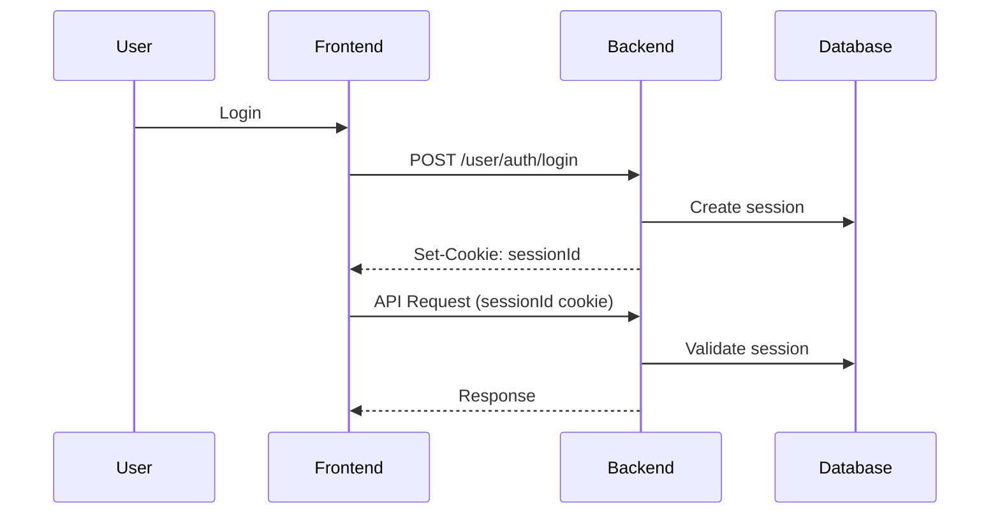
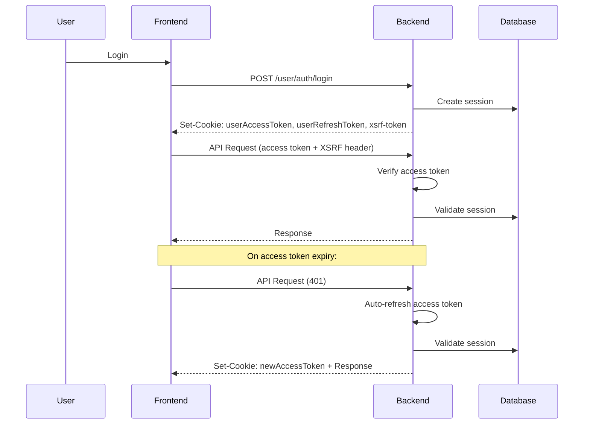
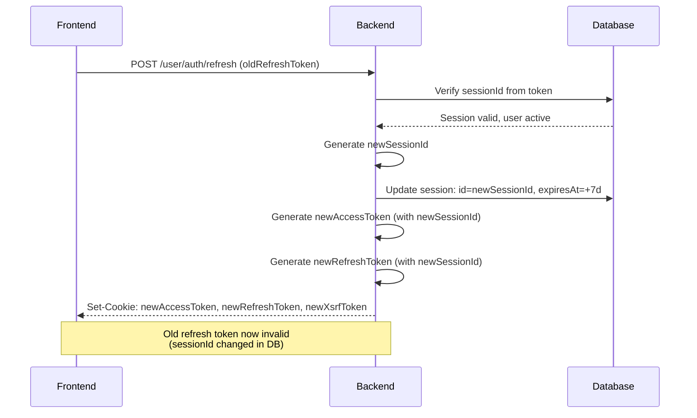

# User V2 JWT Authentication Implementation Plan

## 📋 Overview

This plan outlines the implementation of a **JWT-based access/refresh token mechanism** for user authentication (v2), matching the existing admin authentication architecture. The new system will provide:

- **Short-lived JWT access tokens** (15 minutes)
- **Long-lived JWT refresh tokens** (7 days, extendable on refresh)
- **Persisted sessions in database** for revocation support
- **Automatic token refresh** via guard middleware
- **Full token rotation** on refresh (both access and refresh tokens)
- **Session ID rotation** on refresh (invalidates old refresh tokens)
- **User deactivation check** during refresh
- **CSRF protection** via XSRF tokens

---

## 🎯 Objectives

1. Implement JWT access/refresh token mechanism for user auth
2. Add automatic token refresh in UserAuthGuard
3. Create `/user/auth/refresh` endpoint
4. Update login to return JWT tokens instead of session cookie
5. Maintain backward compatibility with session revocation
6. Update frontend API client to support silent refresh

---

## 🏗️ Architecture

### Current State (v1)



### Target State (v2)



---

## 📦 Phase 1: Environment Configuration

### 1.1 Add JWT Configuration to Environment Schema

**File:** `src/_config/env.schema.ts`

```typescript
// Add user JWT configuration (similar to admin)
JWT_USER_ACCESS_SECRET: string;
JWT_USER_ACCESS_EXP: string;
JWT_USER_REFRESH_SECRET: string;
JWT_USER_REFRESH_EXP: string;
```

**File:** `.env.development`

```env
# === User JWT ===
JWT_USER_ACCESS_SECRET="generate_a_long_random_string_here_at_least_32_chars"
JWT_USER_ACCESS_EXP="15m"
JWT_USER_REFRESH_SECRET="generate_another_long_random_string_here_at_least_32_chars"
JWT_USER_REFRESH_EXP="7d"
```

**File:** `.env.example`

```env
# === User JWT ===
JWT_USER_ACCESS_SECRET="generate_a_long_random_string_here_at_least_32_chars"
JWT_USER_ACCESS_EXP="15m"
JWT_USER_REFRESH_SECRET="generate_another_long_random_string_here_at_least_32_chars"
JWT_USER_REFRESH_EXP="7d"
```

---

## 📦 Phase 2: Cookie Service Updates

### 2.1 Add User Token Cookie Methods

**File:** `src/common/modules/cookie/cookie.service.ts`

Add the following methods:

```typescript
setUserAccessToken(res: Response, token: string) {
  const isProduction = this.configService.nodeEnv === 'production';

  res.cookie('userAccessToken', token, {
    httpOnly: true,
    secure: true,
    maxAge: 900000, // 15 minutes
    sameSite: 'none',
    domain: isProduction ? this.configService.cookieDomain : undefined,
    path: '/',
  });
}

setUserRefreshToken(res: Response, token: string) {
  const isProduction = this.configService.nodeEnv === 'production';

  res.cookie('userRefreshToken', token, {
    httpOnly: true,
    secure: true,
    maxAge: this.configService.sessionMaxAge, // 7 days
    sameSite: 'none',
    domain: isProduction ? this.configService.cookieDomain : undefined,
    path: '/',
  });
}

setUserXsrfToken(res: Response, token: string) {
  const isProduction = this.configService.nodeEnv === 'production';

  res.cookie('user-xsrf-token', token, {
    httpOnly: false, // Must be readable by frontend
    secure: true,
    maxAge: this.configService.sessionMaxAge,
    sameSite: 'none',
    domain: isProduction ? this.configService.cookieDomain : undefined,
    path: '/',
  });
}

clearUserTokens(res: Response) {
  const isProduction = this.configService.nodeEnv === 'production';

  const options = {
    httpOnly: true,
    secure: true,
    sameSite: 'none' as const,
    domain: isProduction ? this.configService.cookieDomain : undefined,
    path: '/',
  };

  res.clearCookie('userAccessToken', options);
  res.clearCookie('userRefreshToken', options);
  res.clearCookie('user-xsrf-token', { ...options, httpOnly: false });
}
```

---

## 📦 Phase 3: User Auth Service Updates

### 3.1 Create User Auth Service v2

**File:** `src/api/user/user-auth/user-auth-v2.service.ts` (new)

```typescript
import { Injectable, UnauthorizedException } from '@nestjs/common';
import { JwtService } from '@nestjs/jwt';
import { AppConfigService } from '@/common/modules/app-config/app-config.service';
import { UserSessionRepository } from '@/_repositories/auth/user-session-repository/user-session-repository.service';
import { TUser, TSession, userTable } from '@/_db/drizzle/schema';
import { eq } from 'drizzle-orm';
import { DrizzleService } from '@/_db/drizzle/drizzle.service';

export interface RefreshTokenResult {
  tokens: {
    accessToken: string;
    refreshToken: string;
  };
  user: TUser;
  session: TSession;
}

@Injectable()
export class UserAuthV2Service {
  constructor(
    private readonly jwtService: JwtService,
    private readonly configService: AppConfigService,
    private readonly userSessionRepository: UserSessionRepository,
    private readonly drizzle: DrizzleService,
  ) {}

  async generateAccessToken(user: TUser, session: TSession) {
    const payload = {
      sub: user.id,
      sessionId: session.id,
      role: 'user',
    };

    return this.jwtService.signAsync(payload, {
      secret: this.configService.jwtUserAccessSecret,
      expiresIn: this.configService.jwtUserAccessExp as any,
    });
  }

  async generateRefreshToken(user: TUser, session: TSession) {
    const payload = {
      sub: user.id,
      sessionId: session.id,
      role: 'user',
    };

    return this.jwtService.signAsync(payload, {
      secret: this.configService.jwtUserRefreshSecret,
      expiresIn: this.configService.jwtUserRefreshExp as any,
    });
  }

  async refreshTokens(currentRefreshToken: string): Promise<RefreshTokenResult> {
    try {
      // 1. Verify refresh token and extract payload
      const payload = await this.jwtService.verifyAsync(currentRefreshToken, {
        secret: this.configService.jwtUserRefreshSecret,
      });

      // 2. Fetch session from DB (with user data)
      const userSession = await this.userSessionRepository.findUserSessionDetailsBySessionId(
        payload.sessionId,
      );

      if (!userSession) {
        throw new UnauthorizedException('Invalid session');
      }

      // 3. Check if session is revoked or expired
      const isRevoked = userSession.session.revoked || userSession.session.logoutAt;
      const isExpired = new Date() > new Date(userSession.session.expiresAt);

      if (isRevoked || isExpired) {
        throw new UnauthorizedException('Session revoked or expired');
      }

      // 4. Check if user is deactivated (soft delete or active flag)
      // Adjust based on your user schema (e.g., deletedAt, isActive, status)
      if (userSession.user.deletedAt || userSession.user.isActive === false) {
        // Revoke the session if user is deactivated
        await this.drizzle.client
          .update(userTable)
          .set({ deletedAt: new Date() }) // or set isActive: false
          .where(eq(userTable.id, userSession.user.id));
        
        throw new UnauthorizedException('User account deactivated');
      }

      // 5. Generate new session ID for rotation (invalidate old refresh tokens)
      const newSessionId = crypto.randomUUID();
      
      // 6. Update session in DB with new ID and extended expiry
      const newExpiresAt = new Date(Date.now() + 7 * 24 * 60 * 60 * 1000); // Extend by 7 days
      await this.drizzle.client
        .update(userTable) // or session table
        .set({
          id: newSessionId, // Rotate session ID
          expiresAt: newExpiresAt, // Extend expiry
        })
        .where(eq(userTable.id, userSession.session.id));

      // 7. Generate new access token with new session ID
      const accessToken = await this.generateAccessToken(
        userSession.user,
        { ...userSession.session, id: newSessionId },
      );

      // 8. Generate new refresh token with new session ID (full rotation)
      const refreshToken = await this.generateRefreshToken(
        userSession.user,
        { ...userSession.session, id: newSessionId },
      );

      return {
        tokens: { accessToken, refreshToken }, // Both tokens rotated
        user: userSession.user,
        session: { ...userSession.session, id: newSessionId, expiresAt: newExpiresAt },
      };
    } catch (e) {
      if (e instanceof UnauthorizedException) {
        throw e;
      }
      throw new UnauthorizedException('Invalid refresh token');
    }
  }
}
```

**Key Security Features:**

| Feature | Implementation |
|---------|---------------|
| **Session Revocation Check** | Checks `session.revoked` and `session.logoutAt` |
| **User Deactivation Check** | Checks `user.deletedAt` or `user.isActive` |
| **Session ID Rotation** | New `sessionId` on each refresh |
| **Full Token Rotation** | Both access and refresh tokens changed |
| **Old Token Invalidation** | Old refresh token uses old sessionId, now invalid |
| **Extended Expiry** | `expiresAt` extended on each successful refresh |

### 3.2 Update User Auth Module

**File:** `src/api/user/user-auth/user-auth.module.ts`

```typescript
import { Module } from '@nestjs/common';
import { UserAuthController } from './user-auth.controller';
import { UserAuthService } from './user-auth.service';
import { UserAuthV2Service } from './user-auth-v2.service'; // New
import { JwtModule } from '@nestjs/jwt';
// ... other imports

@Module({
  imports: [
    // ... existing imports
    JwtModule.register({}), // For JWT operations
  ],
  providers: [
    UserAuthController,
    UserAuthService,
    UserAuthV2Service, // Add
    // ... other providers
  ],
  // ... rest of module config
})
export class UserAuthModule {}
```

---

## 📦 Phase 4: User Auth Controller Updates

### 4.1 Update Login Endpoint

**File:** `src/api/user/user-auth/user-auth.controller.ts`

Update the login method to return JWT tokens:

```typescript
import * as crypto from 'crypto'; // Add import

@Post('login')
async login(
  @Body() payload: any,
  @Req() req: Request,
  @Res({ passthrough: true }) res: Response,
) {
  const i18nContext = I18nContext.current();
  const lang = i18nContext ? i18nContext.lang : 'en';

  // 1. Validate credentials
  const userAuth = await this.userAuthService.validateCredentials(
    { email: payload.email, password: payload.password },
    lang,
  );

  // 2. Perform login (session creation)
  const userAgent = req.headers['user-agent'] || '';
  const deviceInfo = parseDeviceInfo(userAgent);
  const ip = getClientIp(req);
  const session = await this.userAuthService.login({
    user: userAuth.user,
    deviceInfo,
    ip,
  });

  // 3. Generate JWT tokens (V2)
  const accessToken = await this.userAuthV2Service.generateAccessToken(
    userAuth.user,
    session,
  );
  const refreshToken = await this.userAuthV2Service.generateRefreshToken(
    userAuth.user,
    session,
  );

  // 4. Set cookies
  this.cookieService.setUserAccessToken(res, accessToken);
  this.cookieService.setUserRefreshToken(res, refreshToken);

  // 5. Set XSRF Token
  const xsrfToken = crypto.randomUUID();
  this.cookieService.setUserXsrfToken(res, xsrfToken);

  return this.responseService.success({
    message: this.i18n.t('message.success.userLoggedIn', { lang }),
    data: {
      tokens: { accessToken, refreshToken },
      user: userAuth.user,
    },
  });
}
```

### 4.2 Add Refresh Endpoint

**File:** `src/api/user/user-auth/user-auth.controller.ts`

Add new refresh endpoint with **full token rotation** and **user deactivation check**:

```typescript
@ApiOperation({
  summary: 'Refresh access token',
  description: 'Refreshes both access and refresh tokens using current refresh token. Old tokens are invalidated via session ID rotation.',
})
@ApiResponse({ status: 200, description: 'Tokens refreshed successfully' })
@ApiUnauthorizedResponse({
  description: 'Returned if: session revoked, user deactivated, token invalid, or session expired'
})
@Post('refresh')
async refresh(
  @Req() req: Request,
  @Res({ passthrough: true }) res: Response,
) {
  const refreshToken = req.cookies?.userRefreshToken;
  if (!refreshToken) {
    throw new UnauthorizedException('No refresh token provided');
  }

  try {
    const { tokens, user, session } =
      await this.userAuthV2Service.refreshTokens(refreshToken);

    // Set new access token (rotated)
    this.cookieService.setUserAccessToken(res, tokens.accessToken);
    
    // Set new refresh token (rotated - old one is now invalid due to session ID change)
    this.cookieService.setUserRefreshToken(res, tokens.refreshToken);

    // Rotate XSRF Token (for CSRF protection)
    const xsrfToken = crypto.randomUUID();
    this.cookieService.setUserXsrfToken(res, xsrfToken);

    return this.responseService.success({
      message: 'Tokens refreshed successfully',
      data: {
        tokens,
        user,
      },
    });
  } catch (error) {
    // Clear tokens on auth failure (user deactivated, session revoked, etc.)
    this.cookieService.clearUserTokens(res);
    throw error;
  }
}
```

**Refresh Behavior:**

| Scenario | Result |
|----------|--------|
| **Successful refresh** | New access token + new refresh token + new session ID + extended expiry |
| **Session revoked by admin** | 401 + tokens cleared |
| **User deactivated** | 401 + tokens cleared |
| **Invalid/corrupted token** | 401 + tokens cleared |
| **Old refresh token reused** | 401 (session ID no longer valid in DB) |
| **Session expired** | 401 + tokens cleared |

**Token Rotation Flow:**



### 4.3 Update Logout Endpoint

**File:** `src/api/user/user-auth/user-auth.controller.ts`

Update logout to clear JWT tokens:

```typescript
@Post('logout')
async logout(@Req() req: Request, @Res({ passthrough: true }) res: Response) {
  const i18nContext = I18nContext.current();
  const lang = i18nContext ? i18nContext.lang : 'en';
  
  const sessionId = req.cookies?.sessionId as string | undefined;
  const userRefreshToken = req.cookies?.userRefreshToken as string | undefined;
  
  // Revoke session in DB (either by sessionId or refresh token)
  if (sessionId) {
    await this.userAuthService.logout(sessionId);
  } else if (userRefreshToken) {
    // Extract sessionId from refresh token and revoke
    try {
      const payload = await this.jwtService.verifyAsync(userRefreshToken, {
        secret: this.configService.jwtUserRefreshSecret,
      });
      await this.userAuthService.logout(payload.sessionId);
    } catch (e) {
      // Token invalid, ignore
    }
  }
  
  // Clear all cookies
  this.cookieService.clearSessionCookie(res);
  this.cookieService.clearUserTokens(res);

  return this.responseService.success({
    message: this.i18n.t('message.success.loggedOut', { lang }),
    data: null,
  });
}
```

---

## 📦 Phase 5: User Auth Guard Updates

### 5.1 Update UserAuthGuard for Auto-Refresh

**File:** `src/common/guards/user-auth-guard/user-auth.guard.ts`

```typescript
import {
  CanActivate,
  ExecutionContext,
  Injectable,
  UnauthorizedException,
  ForbiddenException,
} from '@nestjs/common';
import { Request, Response } from 'express';
import { UserSessionRepository } from '@/_repositories/auth/user-session-repository/user-session-repository.service';
import { SessionRepository } from '@/_repositories/auth/session.repository/session.repository';
import { JwtService } from '@nestjs/jwt';
import { AppConfigService } from '@/common/modules/app-config/app-config.service';
import { UserAuthV2Service } from '@/api/user/user-auth/user-auth-v2.service';
import { CookieService } from '@/common/modules/cookie/cookie.service';

@Injectable()
export class UserAuthGuard implements CanActivate {
  constructor(
    private readonly userSessionRepository: UserSessionRepository,
    private readonly sessionRepository: SessionRepository,
    private readonly jwtService: JwtService,
    private readonly configService: AppConfigService,
    private readonly userAuthV2Service: UserAuthV2Service,
    private readonly cookieService: CookieService,
  ) {}

  async canActivate(context: ExecutionContext) {
    const request = context.switchToHttp().getRequest() as any;
    const response = context.switchToHttp().getResponse<Response>();

    // 1. CSRF Protection (Double Submit Cookie)
    const stateChangingMethods = ['POST', 'PUT', 'DELETE', 'PATCH'];
    if (stateChangingMethods.includes(request.method)) {
      const xsrfCookie = request.cookies?.['user-xsrf-token'];
      const xsrfHeader = request.headers?.['x-xsrf-token'];

      if (!xsrfCookie || !xsrfHeader || xsrfCookie !== xsrfHeader) {
        throw new ForbiddenException('Invalid CSRF token');
      }
    }

    // 2. JWT Verification
    let accessToken = request.cookies?.userAccessToken;
    const refreshToken = request.cookies?.userRefreshToken;

    let payload: any;

    try {
      if (!accessToken) {
        throw new Error('No access token');
      }
      payload = await this.jwtService.verifyAsync(accessToken, {
        secret: this.configService.jwtUserAccessSecret,
      });
    } catch (e) {
      // Access token expired or missing, try refresh
      if (!refreshToken) {
        throw new UnauthorizedException('Authentication required');
      }

      try {
        const refreshResult = await this.userAuthV2Service.refreshTokens(refreshToken);
        
        // Update access token in cookies (Auto-refresh)
        this.cookieService.setUserAccessToken(response, refreshResult.tokens.accessToken);
        
        payload = await this.jwtService.verifyAsync(refreshResult.tokens.accessToken, {
          secret: this.configService.jwtUserAccessSecret,
        });
      } catch (refreshError) {
        throw new UnauthorizedException('Session expired');
      }
    }

    // 3. Session Validation in DB
    const userSession = await this.userSessionRepository.findUserSessionDetailsBySessionId(
      payload.sessionId,
    );

    if (!userSession) {
      throw new UnauthorizedException('Invalid session');
    }

    const active = this.sessionRepository.isSessionActive(userSession.session);
    if (!active) {
      throw new UnauthorizedException('Session expired');
    }

    request.user = { ...userSession };

    return true;
  }
}
```

---

## 📦 Phase 6: Frontend Updates

### 6.1 Update API Client for Silent Refresh

**File:** `byte-forge-frontend/src/lib/api/api-client.ts`

Add silent refresh logic (similar to admin):

```typescript
/**
 * Silent Refresh State
 */
let isRefreshing = false;
let refreshPromise: Promise<Response> | null = null;
let refreshAttempts = 0;
const MAX_REFRESH_ATTEMPTS = 1;

// Inside fetcher function, after 401 detection:
if (response.status === 401 && strict && !isExcluded) {
  // Silent Refresh
  if (!isRefreshing && refreshAttempts < MAX_REFRESH_ATTEMPTS) {
    isRefreshing = true;
    refreshAttempts++;
    refreshPromise = fetch(`${baseURL}/api/v1/user/auth/refresh`, {
      method: 'POST',
      credentials: 'include',
    }).finally(() => {
      isRefreshing = false;
      refreshPromise = null;
    });
  }

  if (refreshPromise) {
    const refreshResponse = await refreshPromise;
    
    if (refreshResponse?.ok) {
      refreshAttempts = 0;
      // Retry original request with new token (cookies automatically sent)
      response = await makeRequest(fetchOptions, headers);
    } else {
      // Refresh failed - redirect
      refreshAttempts = 0;
      if (import.meta.env.SSR) {
        const { redirect } = await import('@solidjs/router');
        throw redirect('/login');
      } else {
        window.location.href = '/login';
        return {} as T;
      }
    }
  }
}
```

### 6.2 Update Auth API Endpoints

**File:** `byte-forge-frontend/src/lib/api/endpoints/auth.api.ts`

Add refresh method:

```typescript
export const authApi = {
  // ... existing methods

  refresh: async (): Promise<{ tokens: { accessToken: string; refreshToken: string }; user: AuthUser }> => {
    return fetcher<{ tokens: { accessToken: string; refreshToken: string }; user: AuthUser }>('/api/v1/user/auth/refresh', {
      method: 'POST',
    });
  },
};
```

---

## 📦 Phase 7: Testing & Migration

### 7.1 Testing Checklist

- [ ] Login returns JWT tokens
- [ ] Access token expires after 15 minutes
- [ ] Refresh token automatically refreshes access token
- [ ] Revoked sessions cannot refresh
- [ ] CSRF protection works for state-changing requests
- [ ] Logout clears all tokens
- [ ] Silent refresh works in frontend
- [ ] `strict: false` requests don't redirect

### 7.2 Migration Strategy

1. **Backward Compatibility:** Keep session cookie support during transition
2. **Gradual Rollout:** Enable v2 for new logins first
3. **Frontend Update:** Deploy frontend changes after backend is live
4. **Cleanup:** Remove v1 session-only code after full migration

---

## 📊 File Changes Summary

| File | Action | Description |
|------|--------|-------------|
| `src/_config/env.schema.ts` | Modify | Add user JWT config |
| `.env.development` | Modify | Add user JWT secrets |
| `.env.example` | Modify | Add user JWT secrets |
| `src/common/modules/cookie/cookie.service.ts` | Modify | Add user token methods |
| `src/api/user/user-auth/user-auth-v2.service.ts` | Create | JWT token service |
| `src/api/user/user-auth/user-auth.module.ts` | Modify | Add v2 service |
| `src/api/user/user-auth/user-auth.controller.ts` | Modify | Update login, add refresh |
| `src/common/guards/user-auth-guard/user-auth.guard.ts` | Modify | Add auto-refresh |
| `byte-forge-frontend/src/lib/api/api-client.ts` | Modify | Add silent refresh |
| `byte-forge-frontend/src/lib/api/endpoints/auth.api.ts` | Modify | Add refresh method |

---

## 🔐 Security Considerations

1. **Token Storage:** All tokens stored in HTTP-only cookies (not accessible to JavaScript)
2. **CSRF Protection:** XSRF tokens required for state-changing requests
3. **Token Rotation:** Access token rotated on each refresh
4. **Session Revocation:** Sessions can be revoked in DB (admin action)
5. **Secure Cookies:** `secure: true` and `sameSite: 'none'` in production
6. **Short Access Token Lifetime:** 15 minutes limits exposure

---

## 📝 Notes

- The refresh token is **not rotated** (kept same) to simplify implementation
- Session persistence in DB allows admin revocation
- Auto-refresh happens transparently in the guard
- Frontend `strict` parameter controls redirect behavior on refresh failure
